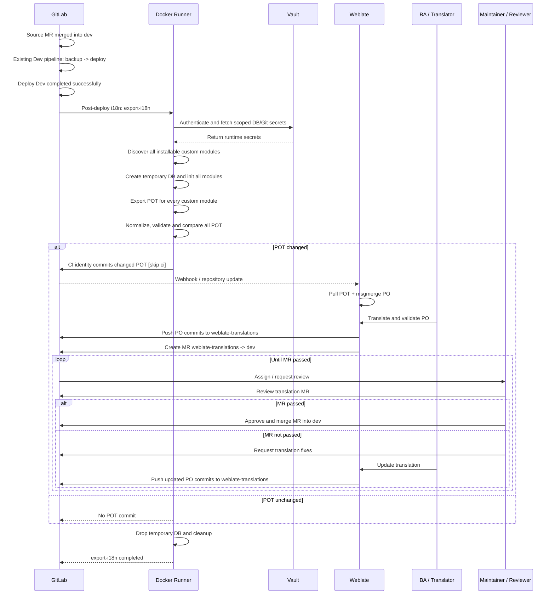

# Cấu hình cần thiết triển khai weblate

## 1. Khái niệm và cấu hình GitLab

### CI identity (tên gọi “CI bot”)

“CI bot” chỉ là tên gọi của technical identity được GitLab CI sử dụng để tạo commit và push POT. Đây không phải là một bot, process hoặc service chạy độc lập.

CI identity chỉ được phép push các file POT đã được job export và validate. Nó không push PO và không thay thế Weblate.

Cấu hình liên quan trong GitLab:

1. Giữ `dev` là protected branch.
2. Cho phép CI identity là ngoại lệ duy nhất được push POT vào `dev`.
3. Bật quyền cho `CI_JOB_TOKEN`:

```text
Project -> Settings -> CI/CD -> Job token permissions
       -> Allow Git push requests to the repository
```

Quyền Job Token không tự động vượt qua protected branch; cần kiểm tra thêm policy của `dev` và user chạy pipeline.

### `[skip ci]` — tránh chạy lại pipeline

Sau khi export, CI identity push commit POT vào `dev`. Commit này chỉ chứa file POT và không cần backup/deploy/export lại. Vì vậy commit message dùng:

```text
[skip ci] [i18n] Update POT templates
```

`[skip ci]` chỉ bỏ qua pipeline mới được tạo từ commit POT. Nó không bỏ qua pipeline source hiện tại và không chặn Push webhook gửi sang Weblate.

### GitLab Push webhook — báo Weblate pull POT

Webhook dùng cho chiều GitLab → Weblate. Khi CI identity push POT vào `dev`, GitLab gửi Push event để Weblate fetch repository và cập nhật POT/PO.

Cấu hình trong GitLab:

```text
Project -> Settings -> Webhooks -> Add new webhook
URL: https://<weblate-domain>/hooks/gitlab/
Event: Push events
```

Webhook không chạy Odoo export, không commit PO và không tự tạo translation MR.

### Branch `weblate-translations` — nơi Weblate push PO

| Branch | Mục đích |
| --- | --- |
| `dev` | Branch source, target của code MR và translation MR |
| `weblate-translations` | Branch Weblate push PO trước khi tạo MR |

Tạo branch `weblate-translations` trong chính repository, bắt đầu từ `dev`, trước khi cấu hình Weblate:

```text
Project -> Repository -> Branches -> New branch
Branch name: weblate-translations
Create from: dev
```

Giữ `dev` là protected branch. CI identity push POT vào `dev`; Weblate push PO vào `weblate-translations` và không push trực tiếp vào `dev`.

Sau khi Weblate push PO, Weblate tạo Merge Request:

```text
source branch: weblate-translations
target branch: dev
```

### Credential

| Tác vụ | Credential | Quyền |
| --- | --- | --- |
| Weblate clone/fetch | SSH key hoặc HTTPS credential | Read repository |
| Weblate push translation branch | SSH key hoặc HTTPS credential | `write_repository` |
| Weblate tạo MR | GitLab API token | `api` |
| CI push POT vào `dev` | `CI_JOB_TOKEN` | Project cho phép push + protected branch policy |

Không ghi token trong repository, YAML, URL Git, log hoặc tài liệu.

## 2. Hai hướng triển khai `export-i18n`

### Hướng 1: Full Export

Mỗi lần job chạy:

1. Tìm toàn bộ custom module hợp lệ trong repository.
2. Tạo database tạm cho job.
3. Cài toàn bộ custom module và dependency cần thiết.
4. Export POT cho toàn bộ custom module của project.
5. Normalize và validate POT.
6. Chỉ stage các file POT có thay đổi.
7. Nếu có thay đổi, commit và push vào `dev` với `[skip ci]`.

Dependency như `base`, `web`, `mail` chỉ phục vụ việc init/export; không export hoặc commit POT của Odoo core.

Đoạn CI job hiện tại thuộc hướng **Full Export** khi dùng cấu hình:

```yaml
I18N_MODULES: ""
```

Job quét toàn bộ `__manifest__.py`, chọn tất cả custom module installable, init chúng vào database tạm và export POT cho từng module. `git diff` chỉ được dùng ở bước cuối để xác định file POT nào thực sự thay đổi; nó không dùng để chọn module bị ảnh hưởng.

Nếu đặt:

```yaml
I18N_MODULES: "g10_access_management"
```

thì job trở thành export theo module được cấu hình sẵn. Đây không phải Changed Module Export vì job vẫn không phân tích Git diff để tự chọn module.

Chi tiết triển khai: [Full Export README](full-export/README.md).

### Hướng 2: Changed Module Export

Mỗi lần job chạy:

1. Lấy danh sách file thay đổi giữa commit trước và commit hiện tại.
2. Map từng file về module sở hữu.
3. Xác định `EXPORT_MODULES` là các module bị ảnh hưởng.
4. Dùng Manifestoo để kiểm tra dependency và tạo `INSTALL_MODULES`.
5. Có thể mở rộng sang module phụ thuộc ngược theo policy của project.
6. Tạo database tạm, init `INSTALL_MODULES` và chỉ export POT của `EXPORT_MODULES`.
7. Normalize, validate, so sánh và chỉ commit POT thay đổi.

Nếu không xác định được commit range, owner module hoặc phạm vi ảnh hưởng, chuyển sang Full Export. Lỗi thiếu dependency hoặc manifest không hợp lệ thì job fail.

Chi tiết triển khai: [Changed Module Export README](changed-module-export/README.md).

## 3. Độ phức tạp và dependency ngoài

| Hướng | Độ phức tạp của CI logic | Dependency ngoài bổ sung | Phần cần duy trì |
| --- | --- | --- | --- |
| Full Export | Thấp hơn | Odoo/Python, PostgreSQL client, GNU gettext, Git | Module discovery và export toàn bộ |
| Changed Module Export | Cao hơn | Toàn bộ dependency của Full Export + Manifestoo, full Git history | Diff parser, module mapping, impact policy, dependency graph, fallback |

Full Export không cần Manifestoo và không cần policy xác định module bị ảnh hưởng. Changed Module Export cần Manifestoo được pin trong đúng virtualenv, cần `GIT_DEPTH: "0"` và phải xử lý các trường hợp commit range hoặc mapping không hợp lệ.

Cả hai hướng đều dùng database tạm, chỉ commit POT thay đổi và dùng `[skip ci]` cho commit do CI identity tạo.
## 4. Chi tiết triển khai Full Export

### Luồng xử lý

```text
Discover toàn bộ module installable
    -> Tạo database tạm
    -> Init toàn bộ custom module
    -> Export POT từng module
    -> Normalize và validate POT
    -> Chỉ stage POT thay đổi
    -> Commit/push POT [skip ci]
```

### Cấu hình module

```yaml
I18N_MODULES: ""
I18N_EXCLUDE_MODULES: ""
```

`I18N_MODULES: ""` nghĩa là job tự quét các `__manifest__.py` và chọn toàn bộ module installable.


### Dependency của Runner

Runner cần có:

| Thành phần | Mục đích |
| --- | --- |
| Python/Odoo virtualenv | Chạy Odoo và export POT |
| GNU gettext `msgfmt` | Validate POT |
| PostgreSQL client | `psql`, `pg_isready`, `createdb`, `dropdb` |
| Git | So sánh POT, commit và push |
| `find`, `realpath` | Discovery và xử lý path |

Không cần cài Manifestoo.

Các biến môi trường chính:

```yaml
ODOO_CORE_ROOT: "/path/to/odoo"
ODOO_BIN: "/path/to/odoo/odoo-bin"
ODOO_PYTHON: "/path/to/venv/bin/python"
ODOO_DB_HOST: "127.0.0.1"
ODOO_DB_PORT: "5432"
ODOO_DB_USER: "odoo_ci"
ODOO_DB_PASSWORD: "<masked-secret>"
I18N_DB_PREFIX: "odoo_i18n"
```

Database dùng cho export phải là database tạm riêng theo từng job; không dùng database Dev/Production.

### Quy tắc commit

Job chỉ được commit các file:

```text
*/i18n/*.pot
```

Nếu POT không thay đổi thì không tạo commit. Nếu có thay đổi, commit message phải có:

```text
[skip ci] [i18n] Update POT templates
```

Weblate nhận commit qua GitLab Push webhook và pull POT từ branch `dev`.

### Độ phức tạp

Đây là hướng triển khai đơn giản: không cần đọc Git diff để chọn module, không cần mapping file về module và không cần dependency impact policy. Chi phí chính là thời gian init/export toàn bộ custom module trong mỗi pipeline.
## 5. Chi tiết triển khai Changed Module Export

### Luồng xử lý

```text
Đọc before SHA -> current SHA
    -> Discovery module và owner path
    -> Phân loại file thay đổi
    -> Chọn EXPORT_MODULES
    -> Tính INSTALL_MODULES
    -> Tạo database tạm
    -> Init dependency
    -> Export POT của module được chọn
    -> Normalize, validate và commit POT thay đổi
```

### Các biến chính

```yaml
GIT_DEPTH: "0"
I18N_FORCE_MODULES: ""
I18N_EXCLUDE_MODULES: ""
I18N_IMPACT_POLICY: "strict-local"
I18N_GLOBAL_GLOBS: ""
I18N_IRRELEVANT_GLOBS: |
  README*
  docs/**
  **/*.po
  **/*.pot
```

`GIT_DEPTH: "0"` cần thiết để job có đủ lịch sử Git xác định commit range.

### Chọn module

CI cần xây module index từ các `__manifest__.py`, sau đó map file thay đổi về module sở hữu.

| Trường hợp | Xử lý |
| --- | --- |
| File thuộc một custom module | Thêm module vào `EXPORT_MODULES` |
| File thuộc global path | Full fallback |
| File không map được owner | Full fallback |
| Không có file liên quan | Không tạo database, không export |
| Commit range không hợp lệ | Full fallback |

`I18N_FORCE_MODULES` chỉ dùng cho backfill hoặc test thủ công.

### Dependency và Manifestoo

Ngoài dependency của Full Export, Runner cần:

| Thành phần | Mục đích |
| --- | --- |
| Manifestoo | Kiểm tra dependency và tạo `INSTALL_MODULES` |
| Full Git history | Đọc before/current commit và Git diff |
| `comm` | So sánh danh sách module/dependency |

Manifestoo cần được cài và pin trong đúng Odoo virtualenv, ví dụ:

```text
manifestoo==1.1
```

Các biến môi trường chính:

```yaml
ODOO_SERIES: "18.0"
MANIFESTOO_BIN: "/path/to/venv/bin/manifestoo"
```

`EXPORT_MODULES` là module cần export POT. `INSTALL_MODULES` gồm `EXPORT_MODULES` và dependency bắc cầu cần để Odoo init/export thành công.

### Impact policy

Policy `strict-local` chỉ export owner module. Nếu project có shared module và muốn export cả module phụ thuộc ngược, cần policy `conservative` cùng logic `list-codepends` của Manifestoo.

Không được dùng Full fallback để che giấu lỗi môi trường, manifest hoặc dependency. Các lỗi đó phải làm job fail.

### Quy tắc commit

Job chỉ được commit các file:

```text
*/i18n/*.pot
```

Commit POT phải có:

```text
[skip ci] [i18n] Update POT templates
```

Job không commit PO hoặc push PO trực tiếp vào `dev`.

### Độ phức tạp

Hướng này phức tạp hơn Full Export vì phải duy trì Git diff parsing, module mapping, impact policy, dependency graph và Full fallback. Đổi lại, mỗi pipeline có thể giảm số module phải init/export khi repository lớn và thay đổi chỉ nằm trong một module.
## 6. Technical implementation plan: i18n CI cho May10 QMS

### 1. CI job i18n và Weblate



#### 1.1. Implementation snippets

#### Trigger và preflight

Job chỉ chạy sau khi source đã merge vào `dev` và deploy Dev thành công. Đây là post-deploy job, không phải deployment gate; nếu i18n lỗi thì source đã deploy xong, chỉ cần retry/alert.

Job dùng hướng **Full Export**: mỗi lần chạy sẽ discovery toàn bộ custom module installable và export POT cho toàn bộ module. Job không đọc Git diff để chọn module và không dùng Manifestoo để phân tích impact.

Trong tài liệu này, **CI bot** là tên gọi của technical identity được GitLab CI sử dụng để tạo commit và push POT. Đây không phải là một bot, process hoặc service chạy độc lập.

Job không dùng database Dev mới hoặc backup mới. Nó tạo một temporary database riêng trên runner để Odoo export POT từ source commit vừa deploy.

Vault không phải nơi chạy database và cũng không trực tiếp tạo Docker container. Runner xác thực với Vault bằng identity của GitLab CI rồi lấy các secret cần thiết trong thời gian job chạy, chẳng hạn:

* Thông tin kết nối PostgreSQL và quyền tạo/xóa database tạm.
* Credential để CI identity push các file POT về GitLab.
* Các thông tin nhạy cảm khác cần cho i18n runner, nếu có.

Sau đó runner dùng các secret này để khởi tạo hoặc kết nối tới PostgreSQL service/container riêng, tạo database có tên duy nhất cho job, chạy Odoo export POT rồi xóa database khi kết thúc. Database tạm không sử dụng database Dev/Production và secret không được ghi trong repository hoặc hard-code trong pipeline.

```yaml
export-i18n:
  stage: i18n
  resource_group: qms-i18n
  needs:
    - job: deploy-server-dev
      artifacts: false
  allow_failure: true
  rules:
    - if: '$CI_PIPELINE_SOURCE == "merge_request_event"'
      when: never
    - if: '$CI_COMMIT_BRANCH == "dev"'
      when: on_success
    - when: never
```

```bash
set -Eeuo pipefail
cd "$CI_PROJECT_DIR"

TEMP_DB="${I18N_DB_PREFIX}_${CI_PIPELINE_ID}_${CI_JOB_ID}"
ODOO_DATA_DIR="$CI_PROJECT_DIR/.odoo-data"
I18N_WORK_DIR="$CI_PROJECT_DIR/.ci-i18n"
EXPORT_DIR="$I18N_WORK_DIR/export"

rm -rf "$I18N_WORK_DIR" "$ODOO_DATA_DIR"
test -x "$ODOO_PYTHON"
test -z "$(git status --porcelain --untracked-files=all)"
mkdir -p "$ODOO_DATA_DIR" "$EXPORT_DIR"
```

#### Discover toàn bộ custom module

Job quét repository để tìm toàn bộ custom module hợp lệ. `I18N_MODULES` để trống nghĩa là export toàn bộ module; `I18N_EXCLUDE_MODULES` chỉ loại trừ các module ngoài phạm vi.

```python
import ast
from pathlib import Path

project_root = Path("$CI_PROJECT_DIR")
modules = {}

for manifest_path in sorted(project_root.rglob("__manifest__.py")):
    module_directory = manifest_path.parent
    if not (module_directory / "__init__.py").is_file():
        continue
    manifest = ast.literal_eval(
        manifest_path.read_text(encoding="utf-8")
    )
    if manifest.get("installable", True) is False:
        continue
    modules[module_directory.name] = module_directory

export_modules_csv = ",".join(sorted(modules))
```

Các module được discovery dùng đồng thời cho `EXPORT_MODULES` và `INSTALL_MODULES`; Odoo sẽ cài thêm dependency cần thiết khi init.

```yaml
I18N_MODULES: ""
I18N_EXCLUDE_MODULES: ""
```

Full Export không cần module impact policy, commit range, module owner mapping hoặc Manifestoo.

#### Temporary DB và Odoo export POT

Job tạo một database PostgreSQL riêng cho từng lần chạy, init toàn bộ custom module rồi gọi Odoo export POT lần lượt cho từng module. Database này chỉ tồn tại trong job và không đụng vào database Dev/Production.

```bash
pg_isready --host="$ODOO_DB_HOST" --port="$ODOO_DB_PORT" \
  --username="$ODOO_DB_USER"

PGPASSWORD="$ODOO_DB_PASSWORD" createdb \
  --host="$ODOO_DB_HOST" \
  --port="$ODOO_DB_PORT" \
  --username="$ODOO_DB_USER" \
  --template=template0 --encoding=UTF8 "$TEMP_DB"

"$ODOO_PYTHON" "$ODOO_BIN" \
  --db_host="$ODOO_DB_HOST" \
  --db_port="$ODOO_DB_PORT" \
  --db_user="$ODOO_DB_USER" \
  --db_password="$ODOO_DB_PASSWORD" \
  --database="$TEMP_DB" \
  --addons-path="$ADDONS_PATH" \
  --init="$export_modules_csv" \
  --without-demo=all --no-http --stop-after-init

IFS=',' read -r -a export_modules <<< "$export_modules_csv"
for module_name in "${export_modules[@]}"; do
  "$ODOO_PYTHON" "$ODOO_BIN" \
    --database="$TEMP_DB" \
    --addons-path="$ADDONS_PATH" \
    --i18n-export="$EXPORT_DIR/${module_name}.pot" \
    --modules="$module_name" \
    --no-http --stop-after-init
done
```

#### Normalize, validate và compare POT

Job ổn định các timestamp tự sinh trong POT, kiểm tra format bằng `msgfmt`, rồi chỉ stage các file POT. Nếu có file ngoài phạm vi POT bị thay đổi, job fail để không commit nhầm source hoặc PO.

```python
for field in ("POT-Creation-Date", "PO-Revision-Date"):
    stable_value = header_value(previous, field)
    if stable_value is None:
        stable_value = "1970-01-01 00:00+0000"
    text = replace_header(text, field, stable_value)

candidate.write_text(text, encoding="utf-8")
```

```bash
msgfmt --check --check-format \
  --output-file=/dev/null "$candidate"

git add -f -- "${generated_pot_files[@]}"

unexpected_tracked_changes="$(
  { git diff --name-only; git diff --cached --name-only; } \
  | sort -u | while IFS= read -r changed_file; do
      case "$changed_file" in
        */i18n/*.pot) ;;
        *) printf '%s\n' "$changed_file" ;;
      esac
    done
)"

test -z "$unexpected_tracked_changes"
```

#### CI identity commit POT

Nếu POT không đổi thì job kết thúc mà không commit. Nếu POT đổi, CI identity chỉ commit các file POT, thêm `[skip ci]` để tránh loop pipeline và push về `dev` bằng token CI.

```bash
if [ "$changed_count" -eq 0 ]; then
  git reset --quiet -- "${generated_pot_files[@]}"
  exit 0
fi

git config user.name "$I18N_GIT_USER_NAME"
git config user.email "$I18N_GIT_USER_EMAIL"
git commit --only -m "$I18N_COMMIT_MESSAGE" -- \
  "${generated_pot_files[@]}"

GIT_ASKPASS="$askpass_script" \
GIT_TERMINAL_PROMPT=0 \
git -c credential.helper= push \
  "$I18N_PUSH_REMOTE" "HEAD:refs/heads/$push_branch"
```

#### Weblate handoff

Sau khi POT được push, Weblate lấy POT mới và đồng bộ sang PO. Translator dịch trên Weblate; Weblate push các commit PO vào branch `weblate-translations`, sau đó tạo translation MR từ `weblate-translations` vào `dev`. CI không sửa PO.

```text
CI identity push POT [skip ci]
        -> GitLab webhook / repository update
        -> Weblate pull POT
        -> Weblate msgmerge PO
        -> Translator validate and translate
        -> Weblate push PO -> weblate-translations
        -> Weblate create translation MR: weblate-translations -> dev
```

#### Cleanup và artifacts

Dù job thành công hay thất bại, phần cleanup vẫn chạy để xóa database và file tạm. Log và patch được giữ lại làm artifact để kiểm tra khi có lỗi.

```bash
after_script:
  - |
    set +e

    if [ -f "$CI_PROJECT_DIR/.ci-i18n/db-created" ]; then
      PGPASSWORD="$ODOO_DB_PASSWORD" dropdb \
        --if-exists \
        --host="$ODOO_DB_HOST" \
        --port="$ODOO_DB_PORT" \
        --username="$ODOO_DB_USER" \
        "$TEMP_DB" || true
    fi

    while IFS= read -r pot_file; do
      [ -z "$pot_file" ] && continue
      git restore --source=HEAD --staged --worktree -- "$pot_file" \
        || rm -f -- "$pot_file"
    done < "$CI_PROJECT_DIR/.ci-i18n/generated-pot-files.txt"

    rm -rf "$CI_PROJECT_DIR/.odoo-data"
    rm -rf "$CI_PROJECT_DIR/.ci-i18n/export"
```

```yaml
artifacts:
  when: always
  paths:
    - .ci-i18n/modules.tsv
    - .ci-i18n/export.log
    - .ci-i18n/i18n-summary.txt
    - .ci-i18n/i18n.patch
    - .ci-i18n/cleanup.log
```

### 2. Variables và files

```yaml
ENABLE_I18N: "true"
I18N_RESOURCE_GROUP: "may10-qms-i18n"
I18N_MODULES: ""
I18N_EXCLUDE_MODULES: ""
I18N_DB_PREFIX: "odoo_i18n"
I18N_PUSH_BRANCH: "dev"
I18N_COMMIT_MESSAGE: "[skip ci] [i18n] Update POT templates"
```

Files dự kiến:

```text
templates/i18n-cicd.yml
scripts/export-i18n.sh
config/docker/Dockerfile.i18n-runner
pipelines/may10-qms.yml
```

### 3. Ảnh hưởng và ràng buộc

- MR gate `ruff → unit-test` không thay đổi.
- Production pipeline không chạy i18n.
- Project chưa bật `ENABLE_I18N` không bị ảnh hưởng.
- Mỗi Odoo series cần Odoo/Python environment tương thích.
- Runner phải có quyền tạo/xóa database tạm và truy cập PostgreSQL.
- Full Export không cần Manifestoo hoặc impact-analysis policy.
- Weblate cần component mapping, POT file mask và GitLab webhook.
