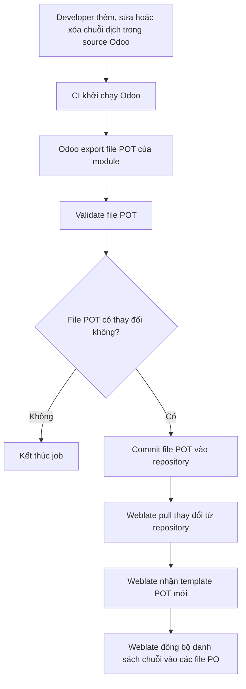
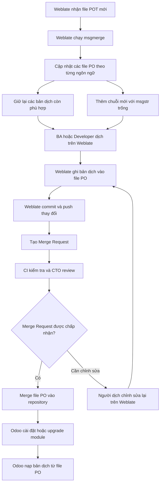
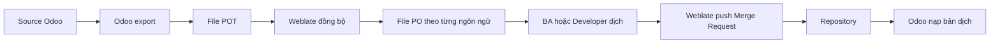
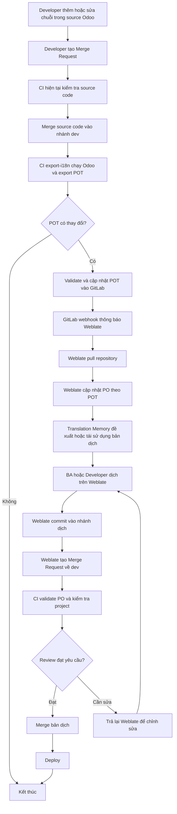
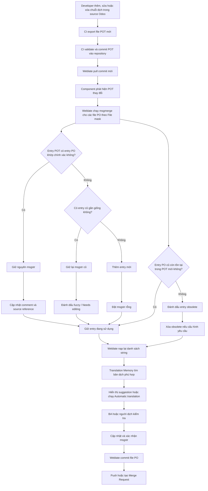
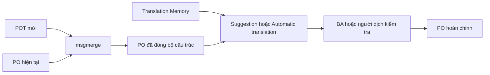
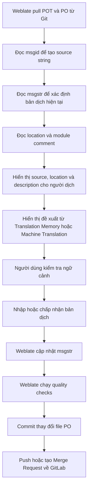

# Kế hoạch kỹ thuật tích hợp Weblate cho dự án Odoo

> **Trạng thái:** Draft for review
> **Phạm vi:** Technical plan tổng quát
> **Mục đích:** Thống nhất kiến trúc.

---

## 1. Mục đích tài liệu

Tài liệu này mô tả kế hoạch kỹ thuật tổng quát để tích hợp Weblate vào quy trình phát triển các dự án Odoo.

Tài liệu tập trung vào:

* Vấn đề cần giải quyết.
* Vai trò của Odoo, GitLab CI và Weblate.
* Cách tổ chức repository Odoo trên Weblate.
* Luồng cập nhật chuỗi nguồn và bản dịch.
* Phạm vi công việc cần triển khai.
* Rủi ro và nguyên tắc tránh conflict.

Tài liệu này **chưa mô tả chi tiết từng bước cấu hình**, câu lệnh triển khai, biến môi trường, Docker Compose hoặc cấu hình cụ thể trên giao diện Weblate. Những nội dung đó sẽ được tách thành tài liệu implementation sau khi plan được phê duyệt.

---

## 2. File POT và PO

### Phân biệt file POT và PO

POT và PO đều là các định dạng thuộc hệ thống quốc tế hóa GNU gettext nhưng có vai trò khác nhau:

| File   | Vai trò                                                                                                       |
| ------ | ------------------------------------------------------------------------------------------------------------- |
| `.pot` | File mẫu chứa danh sách chuỗi nguồn cần dịch. Không đại diện cho ngôn ngữ cụ thể và `msgstr` thường để trống. |
| `.po`  | File chứa bản dịch cho một ngôn ngữ cụ thể. Mỗi `msgid` là chuỗi nguồn và `msgstr` là nội dung đã dịch.       |

File POT xác định **những chuỗi nào cần dịch**, còn file PO xác định **các chuỗi đó được dịch như thế nào trong từng ngôn ngữ**.

### Vai trò của file POT và PO trong Odoo và Weblate

#### Trong Odoo

| File   | Vai trò                                                                                                                                                                                                                                     |
| ------ | ------------------------------------------------------------------------------------------------------------------------------------------------------------------------------------------------------------------------------------------- |
| `.pot` | Là file mẫu của một module, chứa danh sách các chuỗi có thể dịch được Odoo trích xuất từ source code và dữ liệu. File này được đặt trong thư mục `i18n/` và làm cơ sở để tạo hoặc cập nhật các file PO.                                     |
| `.po`  | Là file chứa bản dịch của module cho một ngôn ngữ cụ thể. File được đặt trong thư mục `i18n/`, thường được đặt tên theo mã ngôn ngữ như `vi.po`, `fr.po` hoặc `pt_BR.po`. Odoo nạp nội dung từ file PO khi ngôn ngữ tương ứng được cài đặt. |

Trong Odoo, POT xác định **những chuỗi nào của module cần được dịch**, còn PO cung cấp **bản dịch được Odoo sử dụng cho từng ngôn ngữ**.

Ví dụ cấu trúc của một module:

```text
module_name/
└── i18n/
    ├── module_name.pot
    ├── vi.po
    └── fr.po
```

#### Trong Weblate

| File   | Vai trò                                                                                                                                                                  |
| ------ | ------------------------------------------------------------------------------------------------------------------------------------------------------------------------ |
| `.pot` | Được sử dụng làm file mẫu chứa danh sách chuỗi nguồn của component. Weblate dựa vào file này để nhận biết chuỗi mới, chuỗi thay đổi hoặc chuỗi đã bị loại bỏ.            |
| `.po`  | Là file bản dịch được Weblate quản lý và chỉnh sửa. Mỗi file tương ứng với một ngôn ngữ, trong đó người dịch cập nhật nội dung `msgstr` cho các `msgid` được lấy từ POT. |

Khi POT thay đổi, Weblate có thể sử dụng `msgmerge` để đồng bộ thay đổi vào các file PO:

* Chuỗi mới trong POT được bổ sung vào PO.
* Chuỗi đã thay đổi được đánh dấu cần kiểm tra.
* Chuỗi không còn trong POT được đánh dấu là không còn sử dụng.
* Các bản dịch vẫn còn phù hợp được giữ lại.

Weblate quản lý các file PO thông qua **File mask**, còn file POT được cấu hình tại **Template for new translations**. Sau khi người dùng dịch trên giao diện Weblate, thay đổi được ghi trở lại file PO và có thể được commit hoặc push về repository.

#### Tổng hợp vai trò

| Hệ thống | File `.pot`                                      | File `.po`                                       |
| -------- | ------------------------------------------------ | ------------------------------------------------ |
| Odoo     | Sinh danh sách chuỗi cần dịch của module         | Lưu bản dịch và cung cấp nội dung dịch cho Odoo  |
| Weblate  | Làm nguồn để xác định và đồng bộ danh sách chuỗi | Là đối tượng được người dịch và Weblate cập nhật |

### Luồng xử lý của file POT và PO

#### Luồng của file POT



Trong luồng này:

* Odoo chịu trách nhiệm trích xuất chuỗi và sinh file POT.
* CI chịu trách nhiệm validate, kiểm tra thay đổi và cập nhật POT vào repository.
* Weblate sử dụng POT làm template để đồng bộ danh sách chuỗi trong các file PO.
* POT không chứa bản dịch cho một ngôn ngữ cụ thể.

#### Luồng của file PO



Trong luồng này:

* Weblate chịu trách nhiệm đồng bộ và quản lý nội dung file PO.
* BA hoặc Developer cập nhật nội dung dịch trong `msgstr`.
* Repository lưu phiên bản chính thức của các file PO.
* Odoo đọc file PO để cài đặt hoặc cập nhật bản dịch của ngôn ngữ tương ứng.

#### Quan hệ giữa hai file



File POT đi từ **Odoo sang Weblate** để cung cấp danh sách chuỗi nguồn. File PO đi từ **Weblate về repository và Odoo** để cung cấp nội dung bản dịch.

---

## 3. Vấn đề của cách dịch Odoo hiện tại

Quy trình dịch hiện tại chủ yếu dựa trên việc chỉnh sửa trực tiếp các file `.po` trong source code, dẫn đến các vấn đề sau:

* **Phụ thuộc nhiều vào developer:** Việc cập nhật và chỉnh sửa bản dịch yêu cầu người thực hiện phải hiểu Git, cấu trúc module Odoo và định dạng Gettext, khiến BA hoặc người phụ trách nội dung khó tham gia trực tiếp.
* **Thiếu giao diện quản lý tập trung:** Không có nơi thống nhất để theo dõi các chuỗi chưa dịch, chuỗi cần kiểm tra, tiến độ dịch và chất lượng bản dịch.
* **Khó tái sử dụng bản dịch:** Các bản dịch đã có ở module hoặc dự án khác chưa được quản lý tập trung để tự động đề xuất hoặc tái sử dụng.
* **Dễ phát sinh xung đột dữ liệu:** Việc chỉnh sửa file `.po` từ nhiều nguồn có thể gây conflict, ghi đè hoặc làm mất bản dịch đã có.
* **Tốn thao tác thủ công:** Khi source code có chuỗi dịch mới hoặc thay đổi, developer phải thực hiện các bước cập nhật file dịch trước khi người phụ trách nội dung có thể tiếp tục dịch.

Do đó, hệ thống cần một công cụ quản lý bản dịch tập trung, cho phép nhiều vai trò cùng tham gia, hỗ trợ tái sử dụng bản dịch và đồng bộ an toàn với source code. Weblate được sử dụng để giải quyết các yêu cầu này.


---

## 4. Giải pháp đề xuất: Tích hợp Weblate

Giải pháp được chia thành hai phần trách nhiệm rõ ràng:

* GitLab CI quản lý việc phát hiện và cập nhật chuỗi nguồn.
* Weblate quản lý các file bản dịch và quy trình dịch.

### 4.1. Cấu trúc quản lý trên Weblate

Weblate tổ chức dữ liệu dịch theo ba cấp chính:

```text
Workspace
└── Project
    └── Component
        ├── Template POT
        └── Các file PO theo ngôn ngữ
```

#### Workspace

Workspace là phạm vi quản lý cấp cao nhất, dùng để nhóm nhiều project dịch có liên quan.

Workspace có thể quản lý:

* Danh sách các project thuộc cùng một tổ chức hoặc hệ thống.
* Quyền quản lý workspace.
* Các thiết lập mặc định được kế thừa xuống project và component.
* Translation Memory dùng chung giữa các project trong workspace khi được cấu hình.
* Thông tin billing nếu Weblate sử dụng module billing.

Trong hệ thống Odoo, một workspace có thể đại diện cho toàn bộ các dự án Odoo của một công ty hoặc một nhóm sản phẩm.

Ví dụ:

```text
Workspace: VDX Odoo
├── Project: QMS
├── Project: ERP Internal
└── Project: CRM
```

#### Project

Project là vùng chứa một nhóm component dịch có liên quan.

Project được sử dụng để quản lý các cấu hình chung như:

* Quyền truy cập của người dịch.
* Quy trình review bản dịch.
* Translation Memory trong phạm vi project.
* Glossary và suggestion dùng chung.
* Mẫu commit và Merge Request.
* Các thiết lập mặc định kế thừa xuống component.

Trong cấu trúc Odoo, một project Weblate nên đại diện cho một repository hoặc một hệ thống Odoo.

Ví dụ:

```text
Project: QMS
Repository: odoo-qms
Branch: dev
```

Một project có thể chứa nhiều component tương ứng với các module Odoo trong repository.

#### Component

Component là đơn vị trực tiếp quản lý một nhóm file dịch.

Mỗi component xác định:

* Repository chứa source code.
* Branch được Weblate theo dõi.
* Template `.pot` chứa danh sách chuỗi nguồn.
* File mask dùng để tìm các file `.po`.
* Định dạng file dịch.
* Cách Weblate pull, commit và push thay đổi.
* Các add-on xử lý file dịch.

Trong cấu trúc Odoo, mỗi module Odoo nên được ánh xạ thành một component Weblate vì mỗi module có thư mục `i18n` và tập chuỗi dịch riêng.

Ví dụ:

```text
Project: QMS
└── Component: g10_access_management
    ├── Repository: odoo-qms
    ├── Branch: dev
    ├── Template:
    │   g10_access_management/i18n/g10_access_management.pot
    └── Translation files:
        g10_access_management/i18n/*.po
```

Template `.pot` cung cấp danh sách chuỗi nguồn của component, còn các file `.po` chứa bản dịch cho từng ngôn ngữ.

#### Mapping giữa Weblate và dự án Odoo

| Phạm vi Weblate | Đối tượng quản lý                             | Mapping với Odoo                                      | Ví dụ                   |
| --------------- | --------------------------------------------- | ----------------------------------------------------- | ----------------------- |
| Workspace       | Nhiều project dịch có liên quan               | Toàn bộ các dự án Odoo của công ty hoặc nhóm sản phẩm | `VDX Odoo`              |
| Project         | Nhóm các component thuộc cùng một hệ thống    | Một repository hoặc một hệ thống Odoo                 | `QMS`                   |
| Component       | Repository, branch, template và các file dịch | Một module Odoo                                       | `g10_access_management` |

Cấu trúc áp dụng cho QMS:

```text
Workspace: VDX Odoo
└── Project: QMS
    ├── Component: g10_access_management
    ├── Component: qms_quality
    ├── Component: qms_document
    └── Component: ...
```

Các component của QMS có thể sử dụng chung repository nhưng quản lý template `.pot` và các file `.po` riêng theo từng module Odoo.

### 4.2. CI quản lý chuỗi nguồn

GitLab CI thực hiện:

1. Chạy Odoo với database phục vụ export i18n.
2. Upgrade hoặc khởi tạo module cần kiểm tra.
3. Export danh sách chuỗi nguồn thành file `.pot`.
4. Validate định dạng file `.pot`.
5. So sánh file mới với file đang lưu trong Git.
6. Cập nhật `.pot` vào repository khi có thay đổi.

Mỗi file `.pot` được CI cập nhật sẽ được sử dụng làm template cho component Weblate tương ứng.

Ví dụ:

```text
CI export:
g10_access_management/i18n/g10_access_management.pot

Weblate component:
g10_access_management
```

### 4.3. Weblate quản lý bản dịch

Weblate thực hiện:

1. Pull template `.pot` mới từ GitLab.
2. Xác định component có template thay đổi.
3. Cập nhật các file `.po` của component theo template.
4. Giữ lại những bản dịch còn sử dụng được.
5. Đề xuất hoặc áp dụng lại bản dịch từ Translation Memory.
6. Cung cấp giao diện web cho BA, developer và người dịch.
7. Commit thay đổi bản dịch.
8. Tạo Merge Request về GitLab để review và chạy CI.

Weblate có add-on sử dụng `msgmerge` để cập nhật các file `.po` khớp với template `.pot` được cấu hình cho component.

Quan hệ trách nhiệm giữa các thành phần:

```text
GitLab CI
└── Cập nhật POT của module Odoo
    └── Weblate Component
        ├── Đọc POT làm template
        ├── Cập nhật các file PO
        ├── Áp dụng Translation Memory
        └── Tạo Merge Request về GitLab
```


---

## 5. Luồng hoạt động tổng thể



---

## 6. Luồng cập nhật POT

Sau khi source code được merge:

1. Pipeline xác định các module cần export.
2. Runner khởi động Odoo với database CI.
3. Module được install hoặc upgrade để Odoo có đủ metadata.
4. Odoo export template POT cho từng module.
5. File POT được chuẩn hóa và validate.
6. CI so sánh POT mới với POT trong Git.
7. Nếu không có thay đổi, job kết thúc.
8. Nếu có thay đổi, POT được đưa trở lại repository.
9. GitLab gửi webhook để Weblate pull dữ liệu mới.

### Phương thức cập nhật POT

#### CI bot commit trực tiếp

CI bot có quyền cập nhật POT vào nhánh `dev`.

Ưu điểm:

* Luồng ngắn.
* Weblate nhận template nhanh.

Điều kiện:

* Bot phải có quyền trên protected branch.
* Phải ngăn pipeline tự kích hoạt lặp vô hạn.
* Commit phải được giới hạn chỉ cho file POT.

---

## 7. Luồng cập nhật PO trên Weblate

Trong mỗi Component, Weblate sử dụng hai cấu hình chính để xác định quan hệ giữa file POT và các file PO:

| Cấu hình                          | Vai trò                                                    |
| --------------------------------- | ---------------------------------------------------------- |
| **Template for new translations** | Xác định file POT chứa danh sách chuỗi nguồn của Component |
| **File mask**                     | Xác định các file PO tương ứng với từng ngôn ngữ           |

Ví dụ với module `g10_access_management`:

```text
Template for new translations:
g10_access_management/i18n/g10_access_management.pot

File mask:
g10_access_management/i18n/*.po
```

Trong cấu hình này:

* File `g10_access_management.pot` là template nguồn.
* File `vi.po` chứa bản dịch tiếng Việt.
* File `ja.po` chứa bản dịch tiếng Nhật.
* Các file PO cùng thuộc một Component và được cập nhật theo cùng file POT.

### 7.1. Cơ chế mapping giữa POT và PO

POT và PO đều được tổ chức thành các **Gettext entry**.

Ví dụ entry trong file POT:

```po
#. module: g10_access_management
#: model:ir.model.fields,field_description:...
msgid "Access Groups"
msgstr ""
```

Entry tương ứng trong file `vi.po`:

```po
#. module: g10_access_management
#: model:ir.model.fields,field_description:...
msgid "Access Groups"
msgstr "Nhóm truy cập"
```

Việc mapping giữa entry trong POT và PO được xác định chủ yếu theo:

```text
msgctxt + msgid
```

Trong đó:

| Thành phần | Vai trò                                                               |
| ---------- | --------------------------------------------------------------------- |
| `msgctxt`  | Phân biệt các chuỗi có cùng nội dung nhưng có ngữ cảnh dịch khác nhau |
| `msgid`    | Nội dung chuỗi nguồn                                                  |
| `msgstr`   | Nội dung bản dịch trong file PO                                       |

Các file PO do Odoo export thường không sử dụng `msgctxt`. Vì vậy, trong phạm vi một Component, `msgid` là giá trị chính để xác định entry tương ứng giữa POT và PO.

Các thành phần sau không phải khóa mapping:

```po
#. module: g10_access_management
#: model:ir.model.fields,field_description:...
```

Chúng được sử dụng làm metadata và source reference:

| Thành phần       | Ý nghĩa                                                               |
| ---------------- | --------------------------------------------------------------------- |
| `#. module: ...` | Comment do Odoo sinh ra, cho biết module liên quan                    |
| `#: ...`         | Vị trí hoặc đối tượng sử dụng chuỗi trong source code và dữ liệu Odoo |

Nếu cùng một `msgid` xuất hiện tại nhiều vị trí trong cùng catalog, Gettext có thể biểu diễn chúng thành một entry với nhiều source reference:

```po
#: models/access_group.py:20
#: views/access_group_views.xml:35
msgid "Confirm"
msgstr "Xác nhận"
```

Trong trường hợp mỗi module Odoo được cấu hình thành một Component riêng, cùng một `msgid` ở hai module vẫn được quản lý độc lập vì chúng thuộc hai catalog khác nhau.

Ví dụ:

```text
Component: g10_access_management
msgid: Confirm
msgstr: Xác nhận
```

```text
Component: qms_document
msgid: Confirm
msgstr: Đồng ý
```

Hai bản dịch này không tự động ghi đè nhau. Translation Memory có thể đề xuất bản dịch giữa các Component, nhưng mỗi Component vẫn quản lý file PO riêng.

### 7.2. Luồng cập nhật PO

Khi source Odoo thay đổi và CI export một phiên bản POT mới, Weblate cập nhật các file PO theo luồng sau:



### 7.3. Kết quả khi POT thay đổi

| Thay đổi trong POT                                | Kết quả trong PO                                        |
| ------------------------------------------------- | ------------------------------------------------------- |
| `msgid` không thay đổi                            | Giữ nguyên `msgstr`                                     |
| Source reference thay đổi nhưng `msgid` không đổi | Giữ nguyên `msgstr`, cập nhật source reference          |
| Comment Odoo thay đổi nhưng `msgid` không đổi     | Giữ nguyên `msgstr`, cập nhật comment                   |
| Có `msgid` mới                                    | Thêm entry mới với `msgstr` rỗng                        |
| `msgid` thay đổi nhẹ                              | Có thể giữ bản dịch cũ và đánh dấu `fuzzy`              |
| `msgid` bị xóa khỏi POT                           | Đánh dấu entry PO thành obsolete hoặc xóa theo cấu hình |
| Entry được chuyển sang vị trí source khác         | Giữ bản dịch nếu khóa mapping không thay đổi            |

Ví dụ khi chuỗi nguồn được thay đổi nhẹ:

```po
#, fuzzy
#| msgid "Access Group"
msgid "Access Groups"
msgstr "Nhóm truy cập"
```

Trong đó:

| Thành phần               | Ý nghĩa                                |                |
| ------------------------ | -------------------------------------- | -------------- |
| `#                       | msgid "Access Group"`                  | Chuỗi nguồn cũ |
| `msgid "Access Groups"`  | Chuỗi nguồn mới                        |                |
| `msgstr "Nhóm truy cập"` | Bản dịch cũ được giữ lại để tham khảo  |                |
| `fuzzy`                  | Entry cần được người dịch kiểm tra lại |                |

Trên Weblate, entry dạng này được đưa vào trạng thái cần chỉnh sửa hoặc kiểm tra trước khi được coi là bản dịch hoàn chỉnh.

Ví dụ entry không còn tồn tại trong POT:

```po
#~ msgid "Old source string"
#~ msgstr "Chuỗi nguồn cũ"
```

Tiền tố `#~` cho biết entry đã trở thành obsolete và không còn thuộc danh sách chuỗi nguồn hiện tại.

Tùy cấu hình xử lý Gettext, Weblate có thể:

* Giữ entry obsolete trong file PO.
* Xóa entry obsolete khi lưu file.
* Giữ previous `msgid` để người dịch thấy chuỗi nguồn trước khi thay đổi.

### 7.4. Vai trò của `msgmerge`

`msgmerge` chịu trách nhiệm đồng bộ cấu trúc của file PO theo file POT mới.

Nó xử lý các tác vụ chính:

1. Tìm entry PO tương ứng với entry trong POT.
2. Giữ lại bản dịch khi source string không thay đổi.
3. Thêm các source string mới vào PO.
4. Cập nhật comment và source reference.
5. Đánh dấu `fuzzy` khi source string thay đổi nhưng vẫn có khả năng liên quan tới entry cũ.
6. Đánh dấu obsolete cho entry không còn tồn tại trong POT.

`msgmerge` không phải công cụ dịch nội dung mới. Nó chỉ đồng bộ catalog và cố gắng giữ lại những bản dịch đã tồn tại.

### 7.5. Vai trò của Translation Memory

Translation Memory hoạt động sau bước đồng bộ POT–PO.

Translation Memory tìm các bản dịch đã tồn tại dựa trên:

* Nội dung source string.
* Ngôn ngữ nguồn và ngôn ngữ đích.
* Các bản dịch đã được lưu trong Weblate.
* Phạm vi Translation Memory được phép sử dụng.
* Mức độ tương đồng giữa chuỗi mới và chuỗi đã dịch.

Translation Memory có thể được sử dụng theo ba cách:

| Cách sử dụng                 | Cơ chế                                                          |
| ---------------------------- | --------------------------------------------------------------- |
| Suggestion                   | Hiển thị bản dịch gợi ý để người dịch lựa chọn                  |
| Automatic translation        | Người dùng chủ động chạy thao tác dịch tự động                  |
| Automatic translation add-on | Weblate tự động áp dụng bản dịch khi đáp ứng điều kiện cấu hình |

Translation Memory không quyết định entry POT nào tương ứng với entry PO nào.

Quan hệ trách nhiệm được phân chia như sau:

| Cơ chế                  | Trách nhiệm                                         |
| ----------------------- | --------------------------------------------------- |
| POT                     | Xác định những source string nào cần dịch           |
| `msgmerge`              | Mapping và đồng bộ entry giữa POT và PO             |
| PO                      | Lưu bản dịch của một ngôn ngữ                       |
| Translation Memory      | Tìm và đề xuất nội dung bản dịch có thể tái sử dụng |
| BA hoặc người dịch      | Kiểm tra và xác nhận bản dịch                       |
| Weblate Git integration | Commit và đưa thay đổi PO trở lại repository        |

### 7.6. Phân biệt mapping và translation

Có hai bước độc lập trong quá trình cập nhật:



#### Bước 1: Mapping POT–PO

Mục tiêu là xác định:

* Entry nào vẫn còn tồn tại.
* Entry nào mới được thêm.
* Entry nào đã thay đổi.
* Entry nào không còn được sử dụng.
* Bản dịch nào có thể tiếp tục giữ lại.

Bước này do `msgmerge` thực hiện.

#### Bước 2: Tái sử dụng bản dịch

Mục tiêu là tìm nội dung phù hợp cho các entry chưa dịch hoặc cần kiểm tra.

Bước này do Translation Memory, Automatic translation hoặc machine translation thực hiện.

Do đó:

> `msgmerge` quyết định cấu trúc và trạng thái của entry trong PO. Translation Memory chỉ cung cấp nội dung bản dịch có thể sử dụng cho entry đó.

### 7.7. Kết quả cuối cùng

Sau khi hoàn tất quy trình:

1. File PO có cấu trúc khớp với POT hiện tại.
2. Bản dịch còn hợp lệ được giữ lại.
3. Chuỗi mới được bổ sung vào PO.
4. Chuỗi thay đổi được đánh dấu để kiểm tra.
5. Chuỗi không còn sử dụng được đánh dấu obsolete hoặc loại bỏ.
6. Translation Memory cung cấp các bản dịch có thể tái sử dụng.
7. BA hoặc người dịch hoàn thiện các chuỗi còn lại.
8. Weblate commit file PO.
9. Weblate push trực tiếp hoặc tạo Merge Request về GitLab.

Trong kiến trúc đề xuất:

```text
CI chịu trách nhiệm quản lý POT.
Weblate chịu trách nhiệm cập nhật và quản lý PO.
```

CI không trực tiếp điền hoặc ghi đè nội dung bản dịch trong PO. Việc tái sử dụng bản dịch, kiểm tra chất lượng và hoàn thiện `msgstr` được thực hiện tập trung trên Weblate.


---

## 8. Translation Memory và tái sử dụng bản dịch

Translation Memory được sử dụng để giảm:

* Công việc dịch lặp lại.
* Sự phụ thuộc vào AI.
* Chi phí token hoặc translation API.
* Sự không nhất quán giữa các module.
* Thời gian xử lý các chuỗi thông dụng.

### Các phạm vi Translation Memory dự kiến sử dụng

| Scope            | Mục đích                                               |
| ---------------- | ------------------------------------------------------ |
| Personal memory  | Lưu lịch sử dịch riêng của người dùng                  |
| Project memory   | Tái sử dụng giữa các component trong cùng dự án        |
| Workspace memory | Tái sử dụng giữa nhiều dự án Odoo trong cùng workspace |
| Imported memory  | Nhập các PO/TMX/CSV đã có làm dữ liệu ban đầu          |

Weblate hỗ trợ import Translation Memory từ các định dạng như TMX, JSON, XLIFF, PO và CSV.

---

## 9. Nguyên tắc kiến trúc

### 9.1. GitLab là nguồn dữ liệu chính thức

Source code, `.pot` và `.po` đã được chấp nhận phải được lưu trong GitLab.

Weblate là hệ thống hỗ trợ quản lý và chỉnh sửa bản dịch, không thay thế GitLab làm source of truth.

### 9.2. CI và Weblate không cùng quản lý một loại file

Áp dụng nguyên tắc **single writer**:

| Loại dữ liệu        | Hệ thống chịu trách nhiệm chính |
| ------------------- | ------------------------------- |
| Source code Odoo    | Developer                       |
| Template `.pot`     | GitLab CI                       |
| File bản dịch `.po` | Weblate                         |
| Review và merge     | GitLab                          |

CI không tự động điền hoặc ghi đè nội dung dịch trong `.po`.

Weblate không thay đổi source code và không tự export chuỗi trực tiếp từ runtime Odoo.

Việc cùng chỉnh sửa một file dịch ở Weblate và bên ngoài Weblate là nguyên nhân phổ biến dẫn đến merge conflict.

### 9.3. Không sửa PO thủ công trong luồng thông thường

Sau khi Weblate được đưa vào sử dụng:

* BA và người dịch chỉnh sửa trên Weblate.
* Developer không sửa trực tiếp `.po` trong source code, trừ trường hợp xử lý khẩn cấp.
* Thay đổi thủ công phải được đồng bộ về Weblate trước khi tiếp tục dịch.

### 9.4. Mọi thay đổi phải đi qua Merge Request

Weblate không push trực tiếp vào nhánh protected dùng để deploy.

Weblate commit vào một nhánh dịch và tạo Merge Request về nhánh đích. GitLab tiếp tục chịu trách nhiệm:

* Validate file.
* Chạy pipeline.
* Review thay đổi.
* Merge vào nhánh chính thức.

---

## 10. Weblate đọc file PO của Odoo như thế nào?

## 10. Weblate đọc file PO của Odoo như thế nào?

Weblate đọc file `.po` của Odoo theo định dạng GNU Gettext dạng song ngữ. Mỗi entry trong file tương ứng với một đơn vị dịch trên Weblate, gồm chuỗi nguồn, bản dịch và các thông tin hỗ trợ người dịch.

### 10.1. Cách Weblate phân giải từng thành phần

| Thành phần trong file `.po` | Weblate phân giải thành                   | Cách Weblate sử dụng                                                                                                         |
| --------------------------- | ----------------------------------------- | ---------------------------------------------------------------------------------------------------------------------------- |
| `msgid`                     | Source string                             | Hiển thị nội dung nguồn cần dịch và dùng để xác định chuỗi trong component.                                                  |
| `msgstr`                    | Translation                               | Hiển thị trong ô nhập bản dịch. Khi người dùng lưu bản dịch, Weblate cập nhật lại giá trị này trong file `.po`.              |
| `#: ...`                    | Source string location                    | Hiển thị vị trí sử dụng chuỗi, giúp người dịch xác định chuỗi xuất hiện ở đâu. Có thể tìm kiếm chuỗi theo trường `location`. |
| `#. ...`                    | Source string description                 | Hiển thị thông tin mô tả hoặc developer comment đi kèm chuỗi nguồn.                                                          |
| `#. module: ...`            | Source string description do Odoo sinh ra | Cho biết module Odoo đã sinh ra entry, giúp người dịch nhận biết phạm vi sử dụng của chuỗi.                                  |
| Header PO                   | Metadata của file dịch                    | Xác định ngôn ngữ và lưu các thông tin như project, ngày cập nhật, người dịch, công cụ tạo file và nhóm dịch.                |

Weblate hỗ trợ trực tiếp source string description và source string location của định dạng Gettext. Các thông tin này được hiển thị cùng chuỗi nguồn trong giao diện dịch để người dùng hiểu rõ hơn ngữ cảnh sử dụng.

#### `msgid`

`msgid` là nội dung nguồn mà người dùng nhìn thấy trên giao diện Weblate.

```po
msgid "Access Groups"
```

Trên Weblate:

```text
Source: Access Groups
```

Đây là nội dung chính được dùng để:

* tạo đơn vị dịch;
* tìm các bản dịch tương tự;
* tra cứu Translation Memory;
* kiểm tra sự thay đổi của chuỗi nguồn;
* xác định chuỗi chưa được dịch.

Trong định dạng Gettext, `msgctxt` được dùng cùng với `msgid` để phân biệt những chuỗi có cùng nội dung nhưng khác ngữ cảnh. Weblate cũng sử dụng context để phân biệt các source string giống nhau.

File PO do Odoo sinh ra thường không có `msgctxt`. Vì vậy:

* `#. module: ...` không thay thế cho `msgctxt`;
* metadata module không trở thành khóa định danh của chuỗi;
* các chuỗi có cùng `msgid` trong một component không thể có bản dịch khác nhau chỉ dựa vào comment module.

Việc ánh xạ **một module Odoo thành một component Weblate** giúp giới hạn chuỗi trong phạm vi từng module. Hai module nằm ở hai component khác nhau vẫn có thể quản lý bản dịch độc lập, đồng thời tái sử dụng bản dịch thông qua Translation Memory.

#### `msgstr`

`msgstr` chứa bản dịch của `msgid`.

```po
msgid "Access Groups"
msgstr "Nhóm truy cập"
```

Trên Weblate:

```text
Source:      Access Groups
Translation: Nhóm truy cập
```

Người dùng không cần chỉnh sửa trực tiếp file `.po`. Thay vào đó, họ nhập nội dung trong ô Translation. Khi lưu, Weblate cập nhật `msgstr` và ghi thay đổi vào repository theo cấu hình Git của component.

Nếu `msgstr` để trống, Weblate coi chuỗi chưa có bản dịch:

```po
msgid "Access Groups"
msgstr ""
```

#### `#: ...`

Dòng bắt đầu bằng `#:` là source string location.

Ví dụ với chuỗi lấy từ Python hoặc XML:

```po
#: code:addons/g10_access_management/models/access_group.py:42
```

Hoặc với metadata do Odoo export:

```po
#: model:ir.model.fields,field_description:g10_access_management.field_access_group__name
```

Weblate hiển thị giá trị này trong phần vị trí sử dụng của chuỗi. Người dịch có thể dùng thông tin đó để xác định chuỗi là:

* tên field;
* tên model;
* label trong view;
* nội dung Python;
* dữ liệu XML;
* hoặc nội dung được sinh từ record Odoo.

Source location cũng có thể được tìm kiếm bằng điều kiện `location:` trên Weblate.

Weblate chỉ tạo được liên kết mở source code khi location có dạng đường dẫn file và component đã cấu hình **Repository browser** phù hợp. Các location dạng model identifier của Odoo vẫn được hiển thị làm thông tin tham khảo nhưng thường không thể mở trực tiếp thành một dòng source code.

#### `#. module: ...`

Dòng này là extracted comment do Odoo thêm vào khi export:

```po
#. module: g10_access_management
```

Trên Weblate, thông tin này được sử dụng như source string description hoặc developer comment.

Nó giúp người dịch biết chuỗi được sinh ra từ module nào, đặc biệt hữu ích khi:

* một project Weblate có nhiều component;
* một chuỗi giống nhau xuất hiện trong nhiều module;
* người dịch cần xác định phạm vi nghiệp vụ của chuỗi;
* Translation Memory đưa ra nhiều bản dịch khác nhau cho cùng một `msgid`.

Tuy nhiên, `#. module: ...` chỉ cung cấp thông tin cho người dịch. Nó không:

* tự động chọn bản dịch;
* tự động tạo context;
* thay thế `msgctxt`;
* phân biệt hai entry có cùng `msgid`;
* quyết định Translation Memory nào được sử dụng.

Translation Memory của Weblate quản lý bản dịch theo các thông tin như source string, component, context, cặp ngôn ngữ và scope bộ nhớ. Location hoặc comment module chủ yếu hỗ trợ người dịch đánh giá đề xuất trước khi áp dụng.

#### Header PO

Header nằm ở entry đầu tiên của file:

```po
msgid ""
msgstr ""
"Project-Id-Version: Odoo Server 18.0\n"
"Language: vi\n"
"PO-Revision-Date: 2026-08-03 00:00+0000\n"
"Last-Translator: Weblate Admin\n"
"Language-Team: Vietnamese\n"
"X-Generator: Weblate\n"
```

Header được áp dụng cho toàn bộ file, không phải cho từng chuỗi.

Weblate sử dụng hoặc duy trì các metadata như:

* ngôn ngữ của file;
* thời điểm cập nhật;
* người dịch gần nhất;
* nhóm dịch;
* công cụ tạo file;
* địa chỉ báo lỗi source string.

Weblate có thể tự động cập nhật các trường `Language-Team`, `Last-Translator`, `X-Generator` và `Report-Msgid-Bugs-To` tùy theo file format parameters của component.

### 10.2. Các trạng thái Gettext ảnh hưởng đến giao diện Weblate

Ngoài các thành phần trên, trạng thái của entry cũng ảnh hưởng trực tiếp đến luồng dịch.

#### Chuỗi chưa dịch

```po
msgid "Access Groups"
msgstr ""
```

Weblate đưa chuỗi vào danh sách chưa dịch để người dùng xử lý.

#### Chuỗi đã dịch

```po
msgid "Access Groups"
msgstr "Nhóm truy cập"
```

Weblate coi entry đã có nội dung dịch. Trạng thái cuối cùng có thể là **Translated**, **Waiting for review** hoặc **Approved**, tùy workflow review được cấu hình cho project.

#### Chuỗi fuzzy hoặc source đã thay đổi

```po
#, fuzzy
#| msgid "Access Group"
msgid "Access Groups"
msgstr "Nhóm truy cập"
```

Weblate có thể hiển thị source string cũ và phần khác biệt so với source string mới. Điều này giúp người dịch nhận biết bản dịch cũ cần được kiểm tra lại thay vì dịch lại hoàn toàn. Để giữ thông tin source cũ, quá trình `msgmerge` phải được chạy với tùy chọn `--previous`.

#### Chuỗi obsolete

```po
#~ msgid "Old Access Group"
#~ msgstr "Nhóm truy cập cũ"
```

Đây là chuỗi không còn tồn tại trong template hiện tại. Weblate có thể giữ hoặc loại bỏ các entry obsolete tùy theo file format parameter `po_remove_obsolete`.

### 10.3. Ảnh hưởng đến luồng dịch của người dùng

Luồng xử lý một chuỗi Odoo trên Weblate diễn ra như sau:



Khi mở một chuỗi, người dùng sẽ thấy:

1. Nội dung cần dịch lấy từ `msgid`.
2. Bản dịch hiện tại lấy từ `msgstr`.
3. Module chứa chuỗi lấy từ `#. module: ...`.
4. Vị trí sử dụng lấy từ `#: ...`.
5. Các đề xuất từ Translation Memory, glossary hoặc Machine Translation.
6. Các cảnh báo về placeholder, định dạng, khoảng trắng hoặc markup.

Weblate hiển thị source string cùng các thông tin như context, comment và vị trí sử dụng ngay trên trang dịch. Các thông tin này giúp người dùng quyết định bản dịch phù hợp nhưng không thay đổi trực tiếp khóa định danh của chuỗi.

### 10.4. Ví dụ hoàn chỉnh

File PO của Odoo:

```po
#. module: g10_access_management
#: model:ir.model.fields,field_description:g10_access_management.field_access_group__name
msgid "Access Groups"
msgstr "Nhóm truy cập"
```

Weblate phân giải thành:

| Thông tin trên Weblate    | Giá trị                                                                                  |
| ------------------------- | ---------------------------------------------------------------------------------------- |
| Component                 | `g10_access_management`                                                                  |
| Source string             | `Access Groups`                                                                          |
| Translation               | `Nhóm truy cập`                                                                          |
| Source string description | `module: g10_access_management`                                                          |
| Source string location    | `model:ir.model.fields,field_description:g10_access_management.field_access_group__name` |

Trong trường hợp này:

* `msgid` quyết định nội dung cần dịch;
* `msgstr` là nội dung được Weblate ghi lại;
* module comment giúp người dùng hiểu phạm vi nghiệp vụ;
* location giúp xác định loại dữ liệu Odoo đang sử dụng chuỗi;
* Translation Memory cung cấp đề xuất;
* người dùng là người quyết định bản dịch cuối cùng dựa trên ngữ cảnh được hiển thị.

### 10.5. Kết luận

Weblate không chỉ đọc `msgid` và `msgstr`. Nó còn sử dụng comment, location, header và trạng thái Gettext để xây dựng giao diện dịch có ngữ cảnh.

Trong luồng Odoo:

* `msgid` và `msgstr` là dữ liệu dịch chính;
* `#: ...` và `#. module: ...` là thông tin hỗ trợ người dịch;
* header quản lý metadata ở cấp file;
* `fuzzy` và previous `msgid` hỗ trợ kiểm tra lại khi source thay đổi;
* `msgctxt`, nếu có, mới là thông tin dùng để phân biệt các source string giống nhau về nội dung.

Vì file PO của Odoo thường không có `msgctxt`, việc tổ chức mỗi module Odoo thành một component Weblate riêng là cần thiết để giữ phạm vi quản lý rõ ràng, trong khi Translation Memory ở cấp project hoặc workspace vẫn cho phép tái sử dụng bản dịch giữa các module.


---

## 11. Tổ chức Odoo trên Weblate

Weblate được tổ chức theo ba phạm vi chính:

| Scope         | Đối tượng quản lý                     | Cấu hình chính được sử dụng                                                                               |
| ------------- | ------------------------------------- | --------------------------------------------------------------------------------------------------------- |
| **Workspace** | Nhóm nhiều project có liên quan       | Danh sách project, thiết lập mặc định, workspace-scoped access và Translation Memory dùng trong workspace |
| **Project**   | Một repository hoặc một hệ thống Odoo | Nhóm component, workflow, quyền truy cập, Translation Memory và add-on dùng chung                         |
| **Component** | Một module Odoo                       | Repository, branch, file mask, template POT, định dạng file và đồng bộ Git                                |

Weblate định nghĩa workspace là lớp nằm trên project để nhóm các translation project liên quan. Project tiếp tục quản lý quyền truy cập và workflow riêng.

Mỗi module Odoo được cấu hình thành một Weblate component riêng vì:

* Mỗi module có thư mục `i18n` riêng.
* Mỗi module có template POT riêng.
* Source location và chuỗi dịch cần được tách theo module.
* Có thể theo dõi trạng thái dịch và lỗi độc lập.
* Có thể bật hoặc tắt module khỏi Weblate mà không ảnh hưởng toàn bộ repository.

### Ví dụ với dự án Odoo QMS

```text
Workspace: VDX Odoo
└── Project: Odoo QMS
    ├── Component: g10_access_management
    ├── Component: g10_quality
    └── Component: g10_document
```

Trong cấu trúc này:

* **Workspace `VDX Odoo`** nhóm các hệ thống Odoo của công ty và có thể chia sẻ Translation Memory trong phạm vi workspace.
* **Project `Odoo QMS`** đại diện cho repository hoặc hệ thống QMS.
* Mỗi **component** tương ứng với một module trong source code QMS.
* Các component sử dụng cùng repository nhưng có file mask và template riêng.

Workspace Translation Memory phải được cho phép ở workspace và đồng thời được bật trong workflow của từng project.

---

## 12. Thông tin ngữ cảnh của file PO trên Weblate

Khi người dùng mở một chuỗi dịch, Weblate có thể hiển thị các thông tin chính trong khu vực Translation context:

* **Component:** Module Odoo đang chứa chuỗi.
* **Source string:** Nội dung `msgid`.
* **Source string location:** Vị trí được lấy từ dòng `#:`.
* **Translation file:** File `.po` của ngôn ngữ đang dịch.
* **Comments/metadata:** Thông tin được giữ trong file hoặc bổ sung trên Weblate.
* **Suggestions:** Bản dịch đề xuất từ Translation Memory hoặc translation engine.
* **Checks:** Cảnh báo placeholder, format, punctuation hoặc các lỗi chất lượng khác.

Ví dụ:

```text
Component:
Odoo QMS / g10_access_management

Source string:
Access Groups

Source string location:
code:addons/g10_access_management/models/access_group.py:20
model:ir.ui.menu,name:g10_access_management.menu_access_groups

Translation file:
g10_access_management/i18n/vi.po
```

Thông tin location giúp BA hoặc người dịch xác định chuỗi được dùng trong model, field, menu, view hay Python source mà không cần tự tìm toàn bộ repository.

---

## 13. Kiến trúc tổng thể

Các thành phần tham gia gồm:

### Developer

* Thêm hoặc sửa source code.
* Đánh dấu các chuỗi cần dịch theo cơ chế i18n của Odoo.
* Không cần export PO/POT thủ công trong luồng thông thường.

### GitLab

* Lưu source code và translation files.
* Quản lý branch và Merge Request.
* Gửi webhook khi repository thay đổi.
* Chạy pipeline kiểm tra.

### GitLab CI Runner

* Khởi động môi trường Odoo phục vụ export.
* Export `.pot`.
* Validate `.pot`.
* Phát hiện thay đổi.
* Đưa template mới vào Git.

### Weblate

* Pull repository.
* Đọc template `.pot` và file `.po`.
* Cập nhật PO theo POT.
* Quản lý Translation Memory.
* Cung cấp giao diện dịch.
* Commit bản dịch.
* Tạo Merge Request.

### BA/Translator

* Dịch hoặc kiểm tra nội dung trên Weblate.
* Sử dụng source location, glossary và Translation Memory.
* Không cần thao tác Git trực tiếp.

### Reviewer/Leader

* Review Merge Request.
* Kiểm tra nội dung thay đổi.
* Quyết định merge hoặc yêu cầu sửa.

### Odoo Runtime

* Nạp các file `i18n/<language>.po` khi cài đặt hoặc cập nhật module và ngôn ngữ tương ứng.

---

## 14. Gate kiểm tra bản dịch

BA/Translator là gate duy nhất trong luồng dịch trên Weblate.

BA/Translator chịu trách nhiệm:

1. Kiểm tra nội dung bản dịch.
2. Chỉnh sửa hoặc hoàn thiện các chuỗi chưa đạt yêu cầu.
3. Xác nhận bản dịch sẵn sàng được đưa về repository.

Sau khi bản dịch được xác nhận, Weblate commit các file PO và tạo Merge Request trên GitLab. GitLab CI tiếp tục thực hiện các bước kiểm tra kỹ thuật theo pipeline hiện tại.

---

## 15. Phạm vi triển khai

### Trong phạm vi

* Self-host Weblate cho môi trường nội bộ.
* Kết nối Weblate với GitLab công ty.
* Cấu hình Workspace, Project và Component.
* Export POT tự động bằng GitLab CI.
* Đồng bộ POT từ GitLab sang Weblate.
* Cập nhật PO theo POT trên Weblate.
* Translation Memory trong project và workspace.
* BA/Developer dịch trên Weblate.
* Weblate tạo Merge Request về GitLab.
* Validate POT/PO trong CI.
* Thử nghiệm với một module QMS.
* Viết tài liệu vận hành sau khi pilot thành công.

---

## 16. Các workstream cần triển khai

### Workstream 1 — CI export POT

Kết quả cần đạt:

* Runner có thể chạy Odoo.
* Có database CI dành cho export.
* Có thể export POT theo module.
* Có thể phát hiện thay đổi.
* Có cơ chế tránh commit loop.
* POT được validate trước khi đưa vào Git.

### Workstream 2 — Weblate infrastructure

Kết quả cần đạt:

* Weblate chạy ổn định trên môi trường self-host.
* Có HTTPS và domain nội bộ hoặc domain được phê duyệt.
* Có backup database và translation data.
* Có worker và queue xử lý background task.
* Có tài khoản admin và phân quyền.
* Secret không được ghi trực tiếp trong repository.

### Workstream 3 — GitLab integration

Kết quả cần đạt:

* Weblate pull được repository.
* GitLab webhook kích hoạt Weblate update.
* Weblate có quyền push vào translation branch.
* Weblate tạo được Merge Request.
* Không cần ghi access token trực tiếp trong repository URL.
* Branch và credentials tuân thủ chính sách bảo mật.

### Workstream 4 — Weblate data model

Kết quả cần đạt:

* Workspace đại diện cho nhóm dự án Odoo.
* Project đại diện cho repository hoặc hệ thống.
* Component đại diện cho từng module.
* File mask và template chính xác.
* Component có thể pull và phát hiện PO/POT.
* Có phương án tạo component hàng loạt khi mở rộng.

### Workstream 5 — Translation workflow

Kết quả cần đạt:

* BA có thể tìm chuỗi chưa dịch.
* Người dịch nhìn thấy source location.
* Translation Memory hoạt động giữa các component.
* Exact match và fuzzy match được xử lý theo policy.
* Có glossary cho các thuật ngữ nghiệp vụ quan trọng.
* Weblate commit và tạo MR đúng format.

### Workstream 6 — Validation và review

Kết quả cần đạt:

* CI kiểm tra cú pháp POT/PO.
* CI phát hiện placeholder lỗi.
* CI không cho merge file PO không hợp lệ.
* Reviewer xem được diff bản dịch trên GitLab.
* Có luồng trả MR về Weblate khi cần sửa.
* Có log xác định người dịch và commit tương ứng.

---

## 17. Kế hoạch triển khai theo giai đoạn

### Giai đoạn 1 — Review kiến trúc

* Review tài liệu plan.
* Chốt quyền sở hữu POT và PO.
* Chốt cấu trúc Workspace/Project/Component.
* Chốt chiến lược CI commit POT.
* Chốt luồng Weblate tạo Merge Request.
* Chốt phạm vi Translation Memory.

### Giai đoạn 2 — Pilot CI

* Chọn module `g10_access_management`.
* Thêm một chuỗi test vào source.
* Chạy job export POT.
* Kiểm tra diff.
* Validate POT.
* Kiểm tra cơ chế commit hoặc technical MR.

### Giai đoạn 3 — Pilot Weblate

* Tạo Workspace `VDX Odoo`.
* Tạo Project `Odoo QMS`.
* Tạo Component `g10_access_management`.
* Kết nối repository và branch.
* Cấu hình file mask và POT template.
* Kiểm tra Weblate đọc đúng source location.

### Giai đoạn 4 — Pilot translation workflow

* Thêm BA hoặc translator.
* Thử dịch chuỗi mới.
* Kiểm tra Translation Memory.
* Commit từ Weblate.
* Tạo Merge Request.
* Chạy CI validation.
* Review và merge.

### Giai đoạn 5 — Kiểm tra end-to-end

Thực hiện kịch bản:

1. Developer thêm chuỗi.
2. Source MR được merge.
3. CI cập nhật POT.
4. Weblate pull POT.
5. PO được cập nhật.
6. BA dịch.
7. Weblate tạo MR.
8. CI kiểm tra PO.
9. Reviewer merge.
10. Odoo upgrade module và hiển thị bản dịch.

### Giai đoạn 6 — Mở rộng

* Chuẩn hóa component template.
* Thêm các module QMS còn lại.
* Import các PO hiện có vào Translation Memory.
* Bổ sung glossary.
* Bổ sung backup và monitoring.
* Viết runbook vận hành.
* Đánh giá áp dụng cho project Odoo khác.

---

## 18. Rủi ro và phương án kiểm soát

| Rủi ro            | Nguyên nhân                           | Phương án kiểm soát                            |
| ----------------- | ------------------------------------- | ---------------------------------------------- |
| Conflict PO       | PO bị sửa cả trên Git và Weblate      | Weblate là nơi duy nhất quản lý PO             |
| Ghi đè bản dịch   | CI tự động cập nhật nội dung `msgstr` | CI chỉ quản lý POT                             |
| Pipeline chạy lặp | CI commit POT kích hoạt lại chính job | Dùng commit marker, rules hoặc kiểm tra author |
