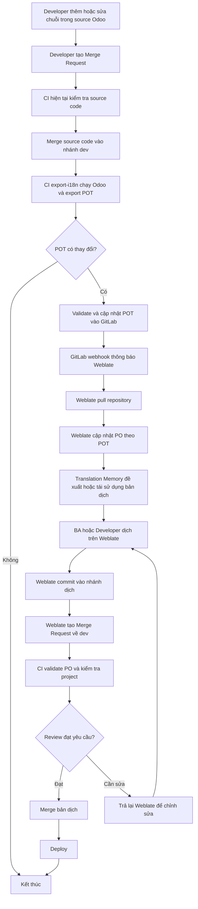

# Kế hoạch kỹ thuật tích hợp Weblate cho dự án Odoo

> **Trạng thái:** Draft for review
> **Phạm vi:** Technical plan tổng quát
> **Mục đích:** Thống nhất kiến trúc.

---

## 1. Mục đích tài liệu

Tài liệu này mô tả kế hoạch kỹ thuật tổng quát để tích hợp Weblate vào quy trình phát triển các dự án Odoo.

Tài liệu tập trung vào:

* Vấn đề cần giải quyết.
* Vai trò của Odoo, GitLab CI và Weblate.
* Cách tổ chức repository Odoo trên Weblate.
* Luồng cập nhật chuỗi nguồn và bản dịch.
* Phạm vi công việc cần triển khai.
* Rủi ro và nguyên tắc tránh conflict.

Tài liệu này **chưa mô tả chi tiết từng bước cấu hình**, câu lệnh triển khai, biến môi trường, Docker Compose hoặc cấu hình cụ thể trên giao diện Weblate. Những nội dung đó sẽ được tách thành tài liệu implementation sau khi plan được phê duyệt.

---

## 2. Vấn đề của cách dịch Odoo hiện tại

* Khi source code có chuỗi dịch mới hoặc thay đổi, developer phải upgrade module và export file dịch thủ công để cập nhật `.pot` hoặc `.po`.
* Việc dịch chủ yếu được thực hiện trực tiếp trên file `.po` trong source code.
* Chỉ những người hiểu Git, cấu trúc module Odoo và định dạng Gettext mới có thể thao tác thuận tiện.
* BA hoặc người phụ trách nội dung khó tham gia trực tiếp vào quá trình dịch.
* Các bản dịch đã có ở module hoặc dự án khác chưa được tái sử dụng tập trung.
* Việc chỉnh sửa `.po` từ nhiều nguồn có thể dẫn đến conflict hoặc ghi đè bản dịch.
* Không có một giao diện tập trung để theo dõi chuỗi chưa dịch, chuỗi cần kiểm tra và chất lượng bản dịch.

Odoo hỗ trợ export các chuỗi có thể dịch thành file POT và đặt các file ngôn ngữ trong thư mục `i18n` của từng module. Những chuỗi trong Python hoặc JavaScript cần được đánh dấu bằng cơ chế i18n tương ứng để Odoo có thể export.

---

## 3. Giải pháp đề xuất: Tích hợp Weblate

Giải pháp được chia thành hai phần trách nhiệm rõ ràng:

### 3.1. CI quản lý chuỗi nguồn

GitLab CI thực hiện:

1. Chạy Odoo với database phục vụ export i18n.
2. Upgrade hoặc khởi tạo module cần kiểm tra.
3. Export danh sách chuỗi nguồn thành file `.pot`.
4. Validate định dạng file `.pot`.
5. So sánh file mới với file đang lưu trong Git.
6. Cập nhật `.pot` vào repository khi có thay đổi.

### 3.2. Weblate quản lý bản dịch

Weblate thực hiện:

1. Pull template `.pot` mới từ GitLab.
2. Cập nhật các file `.po` theo template.
3. Giữ lại những bản dịch còn sử dụng được.
4. Đề xuất hoặc áp dụng lại bản dịch từ Translation Memory.
5. Cung cấp giao diện web cho BA, developer và người dịch.
6. Commit thay đổi bản dịch.
7. Tạo Merge Request về GitLab để review và chạy CI.

Weblate có add-on sử dụng `msgmerge` để cập nhật các file PO khớp với template POT được cấu hình cho component.

---

## 4. Nguyên tắc kiến trúc

### 4.1. GitLab là nguồn dữ liệu chính thức

Source code, `.pot` và `.po` đã được chấp nhận phải được lưu trong GitLab.

Weblate là hệ thống hỗ trợ quản lý và chỉnh sửa bản dịch, không thay thế GitLab làm source of truth.

### 4.2. CI và Weblate không cùng quản lý một loại file

Áp dụng nguyên tắc **single writer**:

| Loại dữ liệu        | Hệ thống chịu trách nhiệm chính |
| ------------------- | ------------------------------- |
| Source code Odoo    | Developer                       |
| Template `.pot`     | GitLab CI                       |
| File bản dịch `.po` | Weblate                         |
| Review và merge     | GitLab                          |

CI không tự động điền hoặc ghi đè nội dung dịch trong `.po`.

Weblate không thay đổi source code và không tự export chuỗi trực tiếp từ runtime Odoo.

Việc cùng chỉnh sửa một file dịch ở Weblate và bên ngoài Weblate là nguyên nhân phổ biến dẫn đến merge conflict.

### 4.3. Không sửa PO thủ công trong luồng thông thường

Sau khi Weblate được đưa vào sử dụng:

* BA và người dịch chỉnh sửa trên Weblate.
* Developer không sửa trực tiếp `.po` trong source code, trừ trường hợp xử lý khẩn cấp.
* Thay đổi thủ công phải được đồng bộ về Weblate trước khi tiếp tục dịch.

### 4.4. Mọi thay đổi phải đi qua Merge Request

Weblate không push trực tiếp vào nhánh protected dùng để deploy.

Weblate commit vào một nhánh dịch và tạo Merge Request về nhánh đích. GitLab tiếp tục chịu trách nhiệm:

* Validate file.
* Chạy pipeline.
* Review thay đổi.
* Merge vào nhánh chính thức.

---

## 5. Weblate đọc file PO của Odoo như thế nào?

Weblate sử dụng định dạng GNU Gettext PO để đọc chuỗi nguồn, bản dịch và các thông tin liên quan.

| Thành phần trong file `.po` | Ý nghĩa trên Weblate                                       |
| --------------------------- | ---------------------------------------------------------- |
| `msgid`                     | Chuỗi nguồn cần dịch                                       |
| `msgstr`                    | Nội dung bản dịch                                          |
| `#: ...`                    | Vị trí sử dụng chuỗi trong source code hoặc dữ liệu Odoo   |
| `#. module: ...`            | Comment/metadata do Odoo sinh ra để xác định module        |
| Header PO                   | Thông tin ngôn ngữ, project, revision và metadata của file |

---

## 6. Tổ chức Odoo trên Weblate

Weblate được tổ chức theo ba phạm vi chính:

| Scope         | Đối tượng quản lý                     | Cấu hình chính được sử dụng                                                                               |
| ------------- | ------------------------------------- | --------------------------------------------------------------------------------------------------------- |
| **Workspace** | Nhóm nhiều project có liên quan       | Danh sách project, thiết lập mặc định, workspace-scoped access và Translation Memory dùng trong workspace |
| **Project**   | Một repository hoặc một hệ thống Odoo | Nhóm component, workflow, quyền truy cập, Translation Memory và add-on dùng chung                         |
| **Component** | Một module Odoo                       | Repository, branch, file mask, template POT, định dạng file và đồng bộ Git                                |

Weblate định nghĩa workspace là lớp nằm trên project để nhóm các translation project liên quan. Project tiếp tục quản lý quyền truy cập và workflow riêng.

Mỗi module Odoo được cấu hình thành một Weblate component riêng vì:

* Mỗi module có thư mục `i18n` riêng.
* Mỗi module có template POT riêng.
* Source location và chuỗi dịch cần được tách theo module.
* Có thể theo dõi trạng thái dịch và lỗi độc lập.
* Có thể bật hoặc tắt module khỏi Weblate mà không ảnh hưởng toàn bộ repository.

### Ví dụ với dự án Odoo QMS

```text
Workspace: VDX Odoo
└── Project: Odoo QMS
    ├── Component: g10_access_management
    ├── Component: g10_quality
    └── Component: g10_document
```

Trong cấu trúc này:

* **Workspace `VDX Odoo`** nhóm các hệ thống Odoo của công ty và có thể chia sẻ Translation Memory trong phạm vi workspace.
* **Project `Odoo QMS`** đại diện cho repository hoặc hệ thống QMS.
* Mỗi **component** tương ứng với một module trong source code QMS.
* Các component sử dụng cùng repository nhưng có file mask và template riêng.

Workspace Translation Memory phải được cho phép ở workspace và đồng thời được bật trong workflow của từng project.

---

## 7. Thông tin ngữ cảnh của file PO trên Weblate

Khi người dùng mở một chuỗi dịch, Weblate có thể hiển thị các thông tin chính trong khu vực Translation context:

* **Component:** Module Odoo đang chứa chuỗi.
* **Source string:** Nội dung `msgid`.
* **Source string location:** Vị trí được lấy từ dòng `#:`.
* **Translation file:** File `.po` của ngôn ngữ đang dịch.
* **Comments/metadata:** Thông tin được giữ trong file hoặc bổ sung trên Weblate.
* **Suggestions:** Bản dịch đề xuất từ Translation Memory hoặc translation engine.
* **Checks:** Cảnh báo placeholder, format, punctuation hoặc các lỗi chất lượng khác.

Ví dụ:

```text
Component:
Odoo QMS / g10_access_management

Source string:
Access Groups

Source string location:
code:addons/g10_access_management/models/access_group.py:20
model:ir.ui.menu,name:g10_access_management.menu_access_groups

Translation file:
g10_access_management/i18n/vi.po
```

Thông tin location giúp BA hoặc người dịch xác định chuỗi được dùng trong model, field, menu, view hay Python source mà không cần tự tìm toàn bộ repository.

---

## 8. Kiến trúc tổng thể

Các thành phần tham gia gồm:

### Developer

* Thêm hoặc sửa source code.
* Đánh dấu các chuỗi cần dịch theo cơ chế i18n của Odoo.
* Không cần export PO/POT thủ công trong luồng thông thường.

### GitLab

* Lưu source code và translation files.
* Quản lý branch và Merge Request.
* Gửi webhook khi repository thay đổi.
* Chạy pipeline kiểm tra.

### GitLab CI Runner

* Khởi động môi trường Odoo phục vụ export.
* Export `.pot`.
* Validate `.pot`.
* Phát hiện thay đổi.
* Đưa template mới vào Git.

### Weblate

* Pull repository.
* Đọc template `.pot` và file `.po`.
* Cập nhật PO theo POT.
* Quản lý Translation Memory.
* Cung cấp giao diện dịch.
* Commit bản dịch.
* Tạo Merge Request.

### BA/Translator

* Dịch hoặc kiểm tra nội dung trên Weblate.
* Sử dụng source location, glossary và Translation Memory.
* Không cần thao tác Git trực tiếp.

### Reviewer/Leader

* Review Merge Request.
* Kiểm tra nội dung thay đổi.
* Quyết định merge hoặc yêu cầu sửa.

### Odoo Runtime

* Nạp các file `i18n/<language>.po` khi cài đặt hoặc cập nhật module và ngôn ngữ tương ứng.

---

## 9. Luồng hoạt động tổng thể



---

## 10. Luồng cập nhật POT

Sau khi source code được merge:

1. Pipeline xác định các module cần export.
2. Runner khởi động Odoo với database CI.
3. Module được install hoặc upgrade để Odoo có đủ metadata.
4. Odoo export template POT cho từng module.
5. File POT được chuẩn hóa và validate.
6. CI so sánh POT mới với POT trong Git.
7. Nếu không có thay đổi, job kết thúc.
8. Nếu có thay đổi, POT được đưa trở lại repository.
9. GitLab gửi webhook để Weblate pull dữ liệu mới.

### Phương thức cập nhật POT

#### CI bot commit trực tiếp

CI bot có quyền cập nhật POT vào nhánh `dev`.

Ưu điểm:

* Luồng ngắn.
* Weblate nhận template nhanh.

Điều kiện:

* Bot phải có quyền trên protected branch.
* Phải ngăn pipeline tự kích hoạt lặp vô hạn.
* Commit phải được giới hạn chỉ cho file POT.

---

## 11. Luồng cập nhật PO trên Weblate

Khi template POT thay đổi:

1. Weblate pull commit mới.
2. Component đọc template POT.
3. Weblate cập nhật các file PO tương ứng với template.
4. Chuỗi mới được thêm vào PO.
5. Chuỗi đã bị xóa khỏi source được đánh dấu hoặc loại bỏ theo cấu hình.
6. Chuỗi nguồn thay đổi được đánh dấu cần kiểm tra.
7. Bản dịch còn phù hợp được giữ lại.
8. Translation Memory tìm các bản dịch tương tự.
9. BA hoặc người dịch kiểm tra và hoàn thiện.
10. Weblate commit PO và tạo Merge Request.

Translation Memory của Weblate có thể được sử dụng dưới dạng suggestion, thao tác Automatic translation hoặc Automatic translation add-on.

---

## 12. Translation Memory và tái sử dụng bản dịch

Translation Memory được sử dụng để giảm:

* Công việc dịch lặp lại.
* Sự phụ thuộc vào AI.
* Chi phí token hoặc translation API.
* Sự không nhất quán giữa các module.
* Thời gian xử lý các chuỗi thông dụng.

### Các phạm vi Translation Memory dự kiến sử dụng

| Scope            | Mục đích                                               |
| ---------------- | ------------------------------------------------------ |
| Personal memory  | Lưu lịch sử dịch riêng của người dùng                  |
| Project memory   | Tái sử dụng giữa các component trong cùng dự án        |
| Workspace memory | Tái sử dụng giữa nhiều dự án Odoo trong cùng workspace |
| Imported memory  | Nhập các PO/TMX/CSV đã có làm dữ liệu ban đầu          |

Weblate hỗ trợ import Translation Memory từ các định dạng như TMX, JSON, XLIFF, PO và CSV.

---

## 13. Quyền và vai trò dự kiến

| Vai trò            | Quyền chính                                             |
| ------------------ | ------------------------------------------------------- |
| Weblate Admin      | Quản lý instance, workspace, integration và credentials |
| Project Maintainer | Quản lý project, component, add-on và workflow          |
| Developer          | Dịch, kiểm tra kỹ thuật, xử lý lỗi format               |
| BA/Translator      | Dịch và kiểm tra nội dung                               |
| Reviewer/Leader    | Review Merge Request trên GitLab                        |
| CI Bot             | Export POT, commit hoặc tạo technical MR                |
| Weblate Bot        | Pull repository, commit PO và tạo translation MR        |

---

## 14. Phạm vi triển khai

### Trong phạm vi

* Self-host Weblate cho môi trường nội bộ.
* Kết nối Weblate với GitLab công ty.
* Cấu hình Workspace, Project và Component.
* Export POT tự động bằng GitLab CI.
* Đồng bộ POT từ GitLab sang Weblate.
* Cập nhật PO theo POT trên Weblate.
* Translation Memory trong project và workspace.
* BA/Developer dịch trên Weblate.
* Weblate tạo Merge Request về GitLab.
* Validate POT/PO trong CI.
* Thử nghiệm với một module QMS.
* Viết tài liệu vận hành sau khi pilot thành công.

---

## 15. Các workstream cần triển khai

### Workstream 1 — CI export POT

Kết quả cần đạt:

* Runner có thể chạy Odoo.
* Có database CI dành cho export.
* Có thể export POT theo module.
* Có thể phát hiện thay đổi.
* Có cơ chế tránh commit loop.
* POT được validate trước khi đưa vào Git.

### Workstream 2 — Weblate infrastructure

Kết quả cần đạt:

* Weblate chạy ổn định trên môi trường self-host.
* Có HTTPS và domain nội bộ hoặc domain được phê duyệt.
* Có backup database và translation data.
* Có worker và queue xử lý background task.
* Có tài khoản admin và phân quyền.
* Secret không được ghi trực tiếp trong repository.

### Workstream 3 — GitLab integration

Kết quả cần đạt:

* Weblate pull được repository.
* GitLab webhook kích hoạt Weblate update.
* Weblate có quyền push vào translation branch.
* Weblate tạo được Merge Request.
* Không cần ghi access token trực tiếp trong repository URL.
* Branch và credentials tuân thủ chính sách bảo mật.

### Workstream 4 — Weblate data model

Kết quả cần đạt:

* Workspace đại diện cho nhóm dự án Odoo.
* Project đại diện cho repository hoặc hệ thống.
* Component đại diện cho từng module.
* File mask và template chính xác.
* Component có thể pull và phát hiện PO/POT.
* Có phương án tạo component hàng loạt khi mở rộng.

### Workstream 5 — Translation workflow

Kết quả cần đạt:

* BA có thể tìm chuỗi chưa dịch.
* Người dịch nhìn thấy source location.
* Translation Memory hoạt động giữa các component.
* Exact match và fuzzy match được xử lý theo policy.
* Có glossary cho các thuật ngữ nghiệp vụ quan trọng.
* Weblate commit và tạo MR đúng format.

### Workstream 6 — Validation và review

Kết quả cần đạt:

* CI kiểm tra cú pháp POT/PO.
* CI phát hiện placeholder lỗi.
* CI không cho merge file PO không hợp lệ.
* Reviewer xem được diff bản dịch trên GitLab.
* Có luồng trả MR về Weblate khi cần sửa.
* Có log xác định người dịch và commit tương ứng.

---

## 16. Kế hoạch triển khai theo giai đoạn

### Giai đoạn 1 — Review kiến trúc

* Review tài liệu plan.
* Chốt quyền sở hữu POT và PO.
* Chốt cấu trúc Workspace/Project/Component.
* Chốt chiến lược CI commit POT.
* Chốt luồng Weblate tạo Merge Request.
* Chốt phạm vi Translation Memory.

### Giai đoạn 2 — Pilot CI

* Chọn module `g10_access_management`.
* Thêm một chuỗi test vào source.
* Chạy job export POT.
* Kiểm tra diff.
* Validate POT.
* Kiểm tra cơ chế commit hoặc technical MR.

### Giai đoạn 3 — Pilot Weblate

* Tạo Workspace `VDX Odoo`.
* Tạo Project `Odoo QMS`.
* Tạo Component `g10_access_management`.
* Kết nối repository và branch.
* Cấu hình file mask và POT template.
* Kiểm tra Weblate đọc đúng source location.

### Giai đoạn 4 — Pilot translation workflow

* Thêm BA hoặc translator.
* Thử dịch chuỗi mới.
* Kiểm tra Translation Memory.
* Commit từ Weblate.
* Tạo Merge Request.
* Chạy CI validation.
* Review và merge.

### Giai đoạn 5 — Kiểm tra end-to-end

Thực hiện kịch bản:

1. Developer thêm chuỗi.
2. Source MR được merge.
3. CI cập nhật POT.
4. Weblate pull POT.
5. PO được cập nhật.
6. BA dịch.
7. Weblate tạo MR.
8. CI kiểm tra PO.
9. Reviewer merge.
10. Odoo upgrade module và hiển thị bản dịch.

### Giai đoạn 6 — Mở rộng

* Chuẩn hóa component template.
* Thêm các module QMS còn lại.
* Import các PO hiện có vào Translation Memory.
* Bổ sung glossary.
* Bổ sung backup và monitoring.
* Viết runbook vận hành.
* Đánh giá áp dụng cho project Odoo khác.

---

## 17. Rủi ro và phương án kiểm soát

| Rủi ro            | Nguyên nhân                           | Phương án kiểm soát                            |
| ----------------- | ------------------------------------- | ---------------------------------------------- |
| Conflict PO       | PO bị sửa cả trên Git và Weblate      | Weblate là nơi duy nhất quản lý PO             |
| Ghi đè bản dịch   | CI tự động cập nhật nội dung `msgstr` | CI chỉ quản lý POT                             |
| Pipeline chạy lặp | CI commit POT kích hoạt lại chính job | Dùng commit marker, rules hoặc kiểm tra author |
