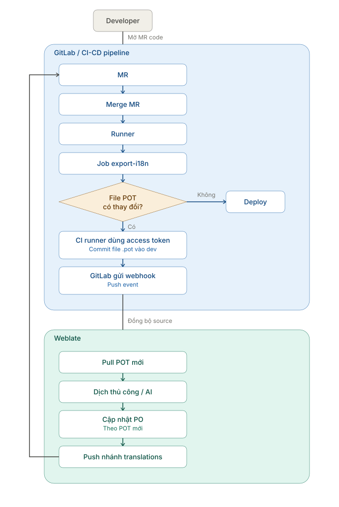

# Weblate Integration for Odoo QMS

## Overview

This document describes the proposed integration between the Odoo QMS project, GitLab CI/CD, and Weblate.

The integration adds translation management to the existing development workflow without replacing the current merge request, review, CI, or deployment processes.

Weblate is responsible for managing translations and updating PO files. GitLab CI/CD is responsible for extracting source terms into POT files, validating changes, and deploying the application.

## Objectives

- Allow developers to mark translatable strings in Python, XML, and JavaScript.
- Automatically export new source terms to POT files.
- Synchronize updated POT files with Weblate.
- Allow BA and functional users to translate through the Weblate interface.
- Return PO changes to GitLab through a translation branch and merge request.
- Preserve the existing CI/CD checks, protected branches, and CTO approval process.

## Pipeline Workflow

The following diagram shows the responsibility boundary between GitLab CI/CD and Weblate.




## Responsibility Boundaries

| Area | Responsibilities |
| --- | --- |
| Developer | Adds or updates translatable source strings and opens a merge request. |
| GitLab | Manages branches, merge requests, webhooks, protected-branch rules, and approvals. |
| GitLab Runner | Runs the existing pipeline and the additional `export-i18n` job. |
| Weblate | Pulls updated POT files, manages translations, updates PO files, and pushes the translation branch. |
| BA / Translator | Translates manually or reviews optional automatic suggestions in Weblate. |
| CTO / Reviewer | Reviews the merge request before translation changes are merged into `dev`. |

## End-to-End Workflow

1. A developer adds or updates translatable strings in the source code.
2. The developer opens a merge request.
3. After approval, the merge request is merged into `dev`.
4. GitLab Runner executes the existing CI/CD pipeline.
5. The additional `export-i18n` job exports source terms and updates the POT files.
6. The pipeline checks whether any POT file has changed:
   - If no POT file changed, the existing deployment workflow continues.
   - If a POT file changed, the CI job commits the updated POT file to `dev`.
7. The GitLab push event sends a webhook to Weblate.
8. Weblate fetches the latest POT file and updates its translation units.
9. BA users or translators translate the new terms manually or use optional automatic suggestions.
10. Weblate updates the corresponding PO files.
11. Weblate pushes the changes to the `weblate-translations` branch.
12. Weblate creates a merge request targeting `dev`.
13. The existing review and CI/CD process runs again before deployment.

## Translation Files

### POT files

POT files are translation templates generated from source code. They contain source terms but do not contain final translations.

The CI/CD pipeline owns POT generation.

### PO files

PO files contain translations for individual languages. Odoo uses these files when modules are installed, upgraded, or loaded at runtime.

Weblate should be the normal owner of PO translation updates.

Existing PO files must remain in the repository. They should not be removed when Weblate is introduced.

## Implementation Approaches

### Approach 1: Preserve the existing PO workflow

Use this approach for the initial proof of concept:

- Keep the existing POT and PO files.
- Import them into Weblate.
- Let BA users edit translations in Weblate.
- Push accumulated PO changes through the translation branch.
- Create a GitLab merge request for review.

This approach verifies Weblate access, translation editing, branch pushing, merge request creation, and the existing CI/CD workflow.

### Approach 2: Add CI-based POT export

Use this approach for the target automated workflow:

- Add an `export-i18n` job to the current pipeline.
- Generate POT files from the latest Odoo source code.
- Commit updated POT files to `dev`.
- Notify Weblate through a GitLab webhook.
- Let Weblate manage PO translations.
- Return PO changes through the translation branch and merge request.

This approach automates the discovery of new source terms while preserving the current review and deployment process.

## Suggested GitLab and Weblate Configuration

| Setting | Suggested value |
| --- | --- |
| Target branch | `dev` |
| Weblate push branch | `weblate-translations` |
| Delivery mode | GitLab merge request |
| Webhook direction | GitLab push event to Weblate |
| Source synchronization | Weblate fetches from `dev` |
| Translation delivery | Weblate pushes PO changes to the translation branch |

### Required credential roles

Keep credentials outside the repository and provide them through protected CI/CD variables, environment variables, or secret files.

| Purpose | Required access |
| --- | --- |
| Clone or fetch the repository | Repository read access |
| Push the translation branch | Repository write access |
| Create a GitLab merge request | GitLab API access |
| Commit an updated POT file from CI | Write access permitted by the project branch policy |

Do not include access tokens, passwords, or credential-bearing repository URLs in this README.

## Webhook Direction

The GitLab webhook is used only for inbound synchronization:

```text
GitLab push -> Weblate webhook -> Weblate fetch/update
```

The webhook does not create the outbound merge request. Weblate creates the merge request separately through the GitLab API.

## Machine Translation

Machine translation is optional and does not change the GitLab or Weblate synchronization workflow.

Available operating modes include:

- Manual translation with Weblate Translation Memory.
- A self-hosted engine such as LibreTranslate or an internal model.
- A third-party translation provider, subject to company policy and billing.

All automatic translations should be reviewed for Odoo placeholders, plural forms, HTML/XML markup, and project terminology before being committed.

## Validation Checklist

- [ ] The Odoo export command works in the CI environment.
- [ ] The correct database, installed modules, and addons paths are available to the export job.
- [ ] The `export-i18n` job detects POT changes correctly.
- [ ] The CI job can commit an updated POT file according to branch protection rules.
- [ ] The GitLab webhook reaches the Weblate instance.
- [ ] Weblate fetches the latest commit from `dev`.
- [ ] New POT terms appear as translation units in Weblate.
- [ ] A BA user can update a translation.
- [ ] Weblate updates the correct PO file.
- [ ] Weblate pushes the `weblate-translations` branch.
- [ ] A merge request from `weblate-translations` to `dev` is created and visible in GitLab.
- [ ] The existing pipeline runs for the translation merge request.
- [ ] The translation is available in Odoo after merge and module update.

## Conflict Prevention

- Avoid editing the same PO entries in Git and Weblate at the same time.
- Commit and push pending Weblate changes before an external process rewrites PO files.
- Treat the source code and generated POT files as the source of translatable terms.
- Treat Weblate as the normal source of PO `msgstr` changes.
- Use merge requests and existing CI checks for all translation changes.

## Current Scope

This integration adds Weblate to the existing QMS CI/CD process. It does not replace:

- GitLab merge requests.
- CI validation jobs.
- Protected-branch rules.
- CTO review and approval.
- The existing deployment process.
