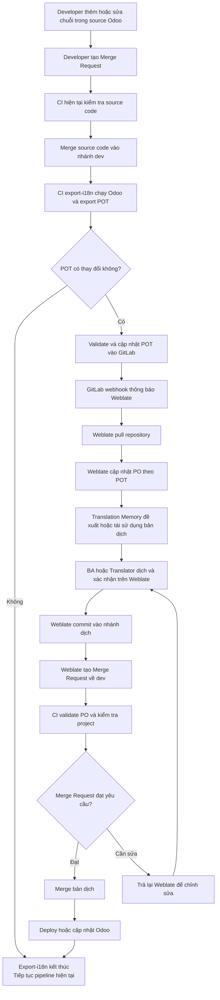
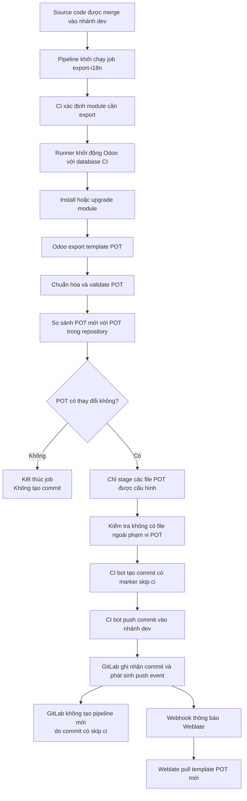
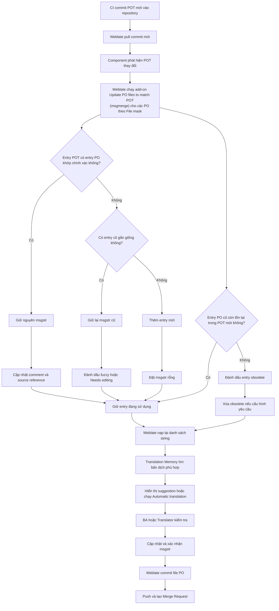
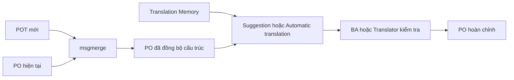

# Kế hoạch kỹ thuật tích hợp Weblate cho dự án Odoo

> **Trạng thái:** Draft for review  
> **Phạm vi:** Technical plan tổng quát  
> **Mục đích:** Thống nhất kiến trúc, trách nhiệm hệ thống và kế hoạch triển khai.

---

## 1. Mục đích tài liệu

Tài liệu này mô tả kế hoạch kỹ thuật tổng quát để tích hợp Weblate vào quy trình phát triển các dự án Odoo.

Tài liệu tập trung vào:

* Vấn đề cần giải quyết.
* Giải pháp và kiến trúc đề xuất.
* Vai trò của Odoo, GitLab, GitLab CI và Weblate.
* Cách tổ chức các dự án Odoo trên Weblate.
* Vai trò và quan hệ giữa file POT và PO.
* Luồng cập nhật chuỗi nguồn và bản dịch.
* Cơ chế mapping Gettext, `msgmerge` và Translation Memory.
* Phạm vi công việc, workstream, kế hoạch triển khai và rủi ro.

Tài liệu này **chưa mô tả chi tiết từng bước cấu hình**, câu lệnh triển khai, biến môi trường, Docker Compose hoặc thao tác cụ thể trên giao diện Weblate. Những nội dung đó sẽ được tách thành tài liệu implementation sau khi plan được phê duyệt.

---

## 2. Vấn đề của cách dịch Odoo hiện tại

Quy trình dịch hiện tại chủ yếu dựa trên việc cập nhật và chỉnh sửa trực tiếp các file `.po` trong source code, dẫn đến các vấn đề sau:

* **Phụ thuộc nhiều vào developer:** Người thực hiện phải hiểu Git, cấu trúc module Odoo và định dạng Gettext, khiến BA hoặc người phụ trách nội dung khó tham gia trực tiếp.
* **Thiếu giao diện quản lý tập trung:** Không có nơi thống nhất để theo dõi chuỗi chưa dịch, chuỗi cần kiểm tra, tiến độ và chất lượng bản dịch.
* **Khó tái sử dụng bản dịch:** Các bản dịch đã có ở module hoặc dự án khác chưa được quản lý tập trung để đề xuất hoặc tái sử dụng.
* **Dễ phát sinh xung đột dữ liệu:** Việc chỉnh sửa file `.po` từ nhiều nguồn có thể gây conflict, ghi đè hoặc làm mất bản dịch.
* **Tốn thao tác thủ công:** Khi source code có chuỗi dịch mới hoặc thay đổi, developer phải cập nhật file dịch trước khi BA hoặc người dịch có thể tiếp tục xử lý.

Hệ thống cần một công cụ quản lý bản dịch tập trung, cho phép nhiều vai trò cùng tham gia, hỗ trợ tái sử dụng bản dịch và đồng bộ an toàn với source code.

---

## 3. Giải pháp đề xuất: Tích hợp Weblate

Giải pháp được chia thành hai phần trách nhiệm chính:

* **GitLab CI quản lý chuỗi nguồn:** Chạy Odoo để export, validate, phát hiện và cập nhật file template `.pot`.
* **Weblate quản lý bản dịch:** Đồng bộ các file `.po` theo template, cung cấp giao diện dịch, Translation Memory và đưa thay đổi trở lại GitLab bằng Merge Request.

Kiến trúc đề xuất áp dụng nguyên tắc:

```text
CI chịu trách nhiệm quản lý POT.
Weblate chịu trách nhiệm cập nhật và quản lý PO.
GitLab lưu phiên bản chính thức và kiểm soát merge.
```

### 3.1. Luồng hoạt động tổng thể



Luồng này tách rõ hai vòng thay đổi:

1. **Vòng source code:** Developer tạo MR, CI kiểm tra, source được merge và CI cập nhật POT.
2. **Vòng translation:** Weblate nhận POT, cập nhật PO, BA/Translator hoàn thiện bản dịch và Weblate tạo MR chứa PO.

Nếu POT không thay đổi, chỉ job `export-i18n` kết thúc và pipeline hiện tại tiếp tục theo quy trình đang có. Nếu POT thay đổi, việc deploy phiên bản chứa thay đổi đó chỉ được thực hiện sau khi Merge Request bản dịch do Weblate tạo đã được kiểm tra và merge.

---

## 4. Kiến trúc tổng thể và trách nhiệm hệ thống

### 4.1. Các thành phần tham gia

| Thành phần | Trách nhiệm chính |
| ---------- | ----------------- |
| Developer | Thêm hoặc sửa source code; đánh dấu chuỗi cần dịch bằng cơ chế i18n của Odoo; không export POT/PO thủ công trong luồng thông thường. |
| GitLab | Lưu source code, POT và PO; quản lý branch, Merge Request, webhook và lịch sử thay đổi. |
| GitLab CI Runner | Khởi động môi trường Odoo; export và validate POT; phát hiện thay đổi; cập nhật POT vào Git. |
| Weblate | Pull repository; đọc POT và PO; đồng bộ PO theo POT bằng add-on `msgmerge` được cấu hình cho component; quản lý Translation Memory; cung cấp giao diện dịch; commit và tạo Merge Request. |
| BA/Translator | Dịch, kiểm tra nội dung, sử dụng context và Translation Memory, sau đó xác nhận bản dịch sẵn sàng đưa về repository. |
| Maintainer/Người có quyền merge | Review Merge Request, kiểm tra thay đổi kỹ thuật và quy trình, quyết định merge hoặc yêu cầu sửa. |
| Odoo Runtime | Nạp các file `i18n/<language>.po` khi cài đặt hoặc cập nhật module và ngôn ngữ tương ứng. |

### 4.2. Quyền sở hữu dữ liệu

Áp dụng nguyên tắc **single writer**:

| Loại dữ liệu | Hệ thống chịu trách nhiệm chính |
| ------------ | ------------------------------- |
| Source code Odoo | Developer |
| Template `.pot` | GitLab CI |
| File bản dịch `.po` | Weblate |
| Validate kỹ thuật và merge | GitLab |

CI không tự động điền hoặc ghi đè nội dung `msgstr` trong PO.

Weblate không thay đổi source code và không tự export chuỗi trực tiếp từ runtime Odoo.

### 4.3. GitLab là nguồn dữ liệu chính thức

Source code, POT và PO đã được chấp nhận phải được lưu trong GitLab.

Weblate là hệ thống hỗ trợ quản lý và chỉnh sửa bản dịch, không thay thế GitLab làm source of truth.

### 4.4. Không sửa PO thủ công trong luồng thông thường

Sau khi Weblate được đưa vào sử dụng:

* BA và người dịch chỉnh sửa trên Weblate.
* Developer không sửa trực tiếp `.po` trong source code, trừ trường hợp xử lý khẩn cấp.
* Thay đổi PO từ bên ngoài Weblate phải được đồng bộ lại trước khi tiếp tục dịch.

Việc cùng chỉnh sửa một file PO ở Weblate và bên ngoài Weblate là nguyên nhân phổ biến dẫn đến merge conflict.

### 4.5. Thay đổi bản dịch phải đi qua Merge Request

Mọi thay đổi đối với nội dung bản dịch và file `.po` phải đi qua Merge Request.

Weblate không push trực tiếp file PO vào nhánh protected dùng để deploy.

Weblate commit vào một nhánh dịch và tạo Merge Request về nhánh đích. GitLab tiếp tục chịu trách nhiệm:

* Validate kỹ thuật file.
* Chạy pipeline.
* Hiển thị diff để truy vết thay đổi.
* Merge vào nhánh chính thức.

Riêng file `.pot` được CI tự động sinh từ source code đã được merge có thể được CI bot commit trực tiếp vào nhánh `dev`. Đây là ngoại lệ duy nhất, chỉ áp dụng cho các file POT đã được job kiểm tra phạm vi và validate; commit phải có marker `[skip ci]` để tránh pipeline lặp.

---

## 5. Tổ chức dự án Odoo trên Weblate

Weblate tổ chức dữ liệu dịch theo ba cấp chính:

```text
Workspace
└── Project
    └── Component
        ├── Template POT
        └── Các file PO theo ngôn ngữ
```

### 5.1. Workspace

Workspace là phạm vi quản lý cấp cao nhất, dùng để nhóm nhiều project dịch có liên quan.

Workspace có thể quản lý:

* Danh sách các project thuộc cùng một tổ chức hoặc hệ thống.
* Quyền quản lý workspace.
* Các thiết lập mặc định được kế thừa xuống project và component.
* Translation Memory dùng chung giữa các project trong workspace khi được cấu hình.
* Thông tin billing nếu Weblate sử dụng module billing.

Trong hệ thống Odoo, một workspace có thể đại diện cho toàn bộ các dự án Odoo của một công ty hoặc một nhóm sản phẩm.

Ví dụ:

```text
Workspace: VDX Odoo
├── Project: QMS
├── Project: ERP Internal
└── Project: CRM
```

### 5.2. Project

Project là vùng chứa một nhóm component dịch có liên quan.

Project được sử dụng để quản lý các cấu hình chung như:

* Quyền truy cập của người dịch.
* Translation Memory trong phạm vi project.
* Glossary và suggestion dùng chung.
* Mẫu commit và Merge Request.
* Các thiết lập mặc định kế thừa xuống component.

Trong cấu trúc Odoo, một project Weblate nên đại diện cho một repository hoặc một hệ thống Odoo.

Ví dụ:

```text
Project: Odoo QMS
Repository: odoo-qms
Branch: dev
```

Một project có thể chứa nhiều component tương ứng với các module Odoo trong repository.

### 5.3. Component

Component là đơn vị trực tiếp quản lý một nhóm file dịch.

Mỗi component xác định:

* Repository chứa source code.
* Branch được Weblate theo dõi.
* Template `.pot` chứa danh sách chuỗi nguồn.
* File mask dùng để tìm các file `.po`.
* Định dạng file dịch.
* Cách Weblate pull, commit và push thay đổi.
* Các add-on xử lý file dịch.

Trong cấu trúc Odoo, mỗi module nên được ánh xạ thành một component Weblate vì mỗi module có thư mục `i18n` và tập chuỗi dịch riêng.

Ví dụ:

```text
Project: Odoo QMS
└── Component: g10_access_management
    ├── Repository: odoo-qms
    ├── Branch: dev
    ├── Template:
    │   g10_access_management/i18n/g10_access_management.pot
    └── Translation files:
        g10_access_management/i18n/*.po
```

### 5.4. Mapping giữa Weblate và dự án Odoo

| Phạm vi Weblate | Đối tượng quản lý | Mapping với Odoo | Ví dụ |
| --------------- | ----------------- | ---------------- | ----- |
| Workspace | Nhiều project dịch có liên quan | Toàn bộ các dự án Odoo của công ty hoặc nhóm sản phẩm | `VDX Odoo` |
| Project | Nhóm component thuộc cùng một hệ thống | Một repository hoặc một hệ thống Odoo | `Odoo QMS` |
| Component | Repository, branch, template và các file dịch | Một module Odoo | `g10_access_management` |

Cấu trúc áp dụng cho QMS:

```text
Workspace: VDX Odoo
└── Project: Odoo QMS
    ├── Component: g10_access_management
    ├── Component: g10_direct_print
    ├── Component: g10_hybrid_mobile
    └── Component: ...
```

Các component của QMS có thể sử dụng chung repository nhưng quản lý template POT và các file PO riêng theo từng module.

Workspace Translation Memory phải được cho phép ở workspace và đồng thời được bật trong workflow của từng project.

---

## 6. File POT và PO

### 6.1. Phân biệt file POT và PO

POT và PO đều là các định dạng thuộc hệ thống quốc tế hóa GNU Gettext nhưng có vai trò khác nhau:

| File | Vai trò |
| ---- | ------- |
| `.pot` | File mẫu chứa danh sách chuỗi nguồn cần dịch. Không đại diện cho ngôn ngữ cụ thể và `msgstr` thường để trống. |
| `.po` | File chứa bản dịch cho một ngôn ngữ cụ thể. Mỗi `msgid` là chuỗi nguồn và `msgstr` là nội dung đã dịch. |

File POT xác định **những chuỗi nào cần dịch**, còn file PO xác định **các chuỗi đó được dịch như thế nào trong từng ngôn ngữ**.

### 6.2. Vai trò trong Odoo

| File | Vai trò trong Odoo |
| ---- | ------------------ |
| `.pot` | File mẫu của một module, chứa danh sách chuỗi có thể dịch được Odoo trích xuất từ source code và dữ liệu. File được đặt trong thư mục `i18n/` và làm cơ sở để tạo hoặc cập nhật PO. |
| `.po` | File chứa bản dịch của module cho một ngôn ngữ cụ thể. File được đặt trong thư mục `i18n/`, thường có tên như `vi.po`, `fr.po` hoặc `pt_BR.po`. Odoo nạp nội dung khi ngôn ngữ tương ứng được cài đặt hoặc cập nhật. |

Ví dụ cấu trúc của một module:

```text
module_name/
└── i18n/
    ├── module_name.pot
    ├── vi.po
    └── fr.po
```

### 6.3. Vai trò trong Weblate

| File | Vai trò trong Weblate |
| ---- | --------------------- |
| `.pot` | Được sử dụng làm file mẫu chứa danh sách chuỗi nguồn của component. Weblate dựa vào file này để nhận biết chuỗi mới, chuỗi thay đổi hoặc chuỗi bị loại bỏ. |
| `.po` | Là file bản dịch được Weblate quản lý và chỉnh sửa. Mỗi file tương ứng với một ngôn ngữ, trong đó người dịch cập nhật `msgstr` cho các `msgid` được lấy từ POT. |

Weblate quản lý các file PO thông qua **File mask**, còn file POT được cấu hình tại **Template for new translations**.

Sau khi người dùng dịch trên giao diện Weblate, thay đổi được ghi trở lại file PO và được commit hoặc push về repository theo cấu hình Git của component.

Để các file PO tự động được cập nhật khi POT thay đổi, component phải cài add-on **Update PO files to match POT (msgmerge)** với trigger cập nhật repository. Chỉ cấu hình **Template for new translations** và **File mask** không tự động chạy `msgmerge` cho toàn bộ file PO.

---

## 7. Luồng cập nhật POT

Sau khi source code được merge, GitLab CI thực hiện:

1. Xác định các module cần export.
2. Khởi động Odoo với database phục vụ export i18n.
3. Install hoặc upgrade module để Odoo có đủ metadata.
4. Export template POT cho từng module.
5. Chuẩn hóa và validate file POT.
6. So sánh POT mới với POT đang lưu trong Git.
7. Nếu không có thay đổi, job kết thúc.
8. Nếu có thay đổi, chỉ các file POT thuộc phạm vi cấu hình được stage.
9. CI bot tạo commit có marker `[skip ci]` và push trực tiếp vào nhánh `dev`.
10. GitLab phát sinh push event để Weblate pull template mới nhưng không tạo pipeline cho commit kỹ thuật này.



### 7.1. Quan hệ giữa POT và Component

Mỗi file POT được CI cập nhật sẽ được sử dụng làm template cho component Weblate tương ứng.

Ví dụ:

```text
CI export:
g10_access_management/i18n/g10_access_management.pot

Weblate component:
g10_access_management
```

### 7.2. Phương thức cập nhật POT: CI bot commit trực tiếp

Sau khi job `export-i18n` phát hiện file POT thay đổi, pipeline sử dụng một danh tính kỹ thuật gọi là **CI bot** để commit và push file POT trực tiếp vào nhánh `dev`.

CI bot không thực hiện việc export POT. Việc export, validate và kiểm tra thay đổi thuộc trách nhiệm của job `export-i18n`. CI bot chỉ cung cấp danh tính và quyền cần thiết để pipeline ghi kết quả trở lại repository.

Vai trò của CI bot:

| Vai trò | Tác vụ |
| ------- | ------ |
| Danh tính commit | Xác định commit cập nhật POT được tạo tự động bởi pipeline. |
| Xác thực GitLab | Cung cấp credentials để pipeline push vào repository. |
| Giới hạn quyền | Chỉ được cấp quyền tối thiểu cần thiết để cập nhật POT. |
| Truy vết thay đổi | Giúp phân biệt commit kỹ thuật với commit do developer tạo. |

Cấu hình dự kiến sử dụng **`[skip ci]` làm cơ chế chính để tránh pipeline loop**.

Commit cập nhật POT sẽ có marker `[skip ci]` trong commit message. Khi CI bot push commit này:

1. GitLab vẫn ghi nhận commit và phát sinh push event.
2. Webhook vẫn thông báo cho Weblate pull template POT mới.
3. GitLab không tạo pipeline mới cho commit có `[skip ci]`.
4. Job `export-i18n` vì vậy không chạy lại trên chính commit POT vừa được tạo.

Cách này phù hợp vì commit kỹ thuật chỉ chứa các file POT đã được export, kiểm tra phạm vi và validate trong pipeline của commit source trước đó. Commit POT không cần chạy lại toàn bộ pipeline một lần nữa.

Ưu điểm:

* Luồng cập nhật ngắn.
* POT được lưu trực tiếp trên nhánh `dev`.
* Weblate nhận template mới ngay sau khi CI hoàn tất.
* Không cần tạo và review một Merge Request chỉ chứa thay đổi POT.
* Không phát sinh pipeline lặp cho commit cập nhật POT.

Điều kiện:

* CI bot phải có quyền push vào nhánh `dev` nếu đây là protected branch.
* Quyền của bot phải được giới hạn ở mức tối thiểu cần thiết.
* Job chỉ được phép commit các file POT thuộc phạm vi cấu hình.
* Pipeline phải kiểm tra `git diff` trước khi tạo commit.
* Pipeline phải xác nhận không có file ngoài phạm vi POT được stage.
* Commit message phải chứa marker `[skip ci]`.
* Credentials của bot phải được lưu trong CI/CD Variables dạng masked và protected, không được ghi trực tiếp trong file cấu hình pipeline.

Ví dụ commit message:

```text
[CI i18n][skip ci] Update translation templates
```

---

## 8. Luồng cập nhật PO trên Weblate

Trong mỗi component, Weblate sử dụng hai cấu hình chính để xác định quan hệ giữa POT và PO:

| Cấu hình | Vai trò |
| -------- | ------- |
| **Template for new translations** | Xác định file POT chứa danh sách chuỗi nguồn của component. |
| **File mask** | Xác định các file PO tương ứng với từng ngôn ngữ. |

Ví dụ với module `g10_access_management`:

```text
Template for new translations:
g10_access_management/i18n/g10_access_management.pot

File mask:
g10_access_management/i18n/*.po
```

Trong cấu hình này:

* `g10_access_management.pot` là template nguồn.
* `vi.po` chứa bản dịch tiếng Việt.
* `ja.po` chứa bản dịch tiếng Nhật.
* Các file PO cùng thuộc một component và được cập nhật theo cùng file POT.

### 8.1. Cơ chế mapping giữa POT và PO trong Odoo

Trong repo Odoo, quan hệ giữa POT và PO được xác định từ **phạm vi module/component** và **nội dung entry nguồn**. Weblate không mapping theo vị trí dòng, comment hoặc nội dung bản dịch.

#### Cấp module/component

Mỗi module Odoo được cấu hình thành một Weblate component riêng. Hai cấu hình sau liên kết template POT với các file PO của cùng module:

* **Template for new translations** trỏ tới file POT của module.
* **File mask** trỏ tới các file PO theo ngôn ngữ trong thư mục `i18n/` của module.

Ví dụ:

```text
Component: g10_access_management
POT: g10_access_management/i18n/g10_access_management.pot
PO:  g10_access_management/i18n/vi.po
```

Do đó, entry trong `g10_access_management.pot` chỉ được đối chiếu với các entry trong những file PO thuộc component `g10_access_management`. Cùng một chuỗi xuất hiện ở module khác được xử lý trong component/catalog khác.

#### Cấp Gettext entry trong catalog Odoo

Trong phần lớn file POT/PO do Odoo export, entry không có `msgctxt`. Khi đó, trong cùng một component/catalog, `msgid` là giá trị chính để đối chiếu entry giữa POT và PO.

```po
# POT
msgid "Access Groups"
msgstr ""

# vi.po
msgid "Access Groups"
msgstr "Nhóm truy cập"
```

Tuy nhiên, Odoo có thể export `msgctxt` khi cần phân biệt các entry có cùng tuyệt đối một `msgid` nhưng được sử dụng trong những context khác nhau. Khi entry có `msgctxt`, cặp `msgctxt + msgid` được dùng để phân biệt entry; không được chỉ dùng `msgid` trong trường hợp này.

Ví dụ minh họa cơ chế:

```po
msgctxt "context A"
msgid "Button"
msgstr ""

msgctxt "context B"
msgid "Button"
msgstr ""
```

| Thành phần trong entry Odoo | Vai trò |
| --------------------------- | ------- |
| `msgid` | Chuỗi nguồn; là giá trị chính để đối chiếu khi entry không có `msgctxt`, và là một phần của khóa đối chiếu khi `msgctxt` có mặt. Trên Weblate, giá trị này được hiển thị là **Source string**. |
| `msgctxt` nếu Odoo export | Context dùng để phân biệt các entry có cùng `msgid`; chỉ được sử dụng khi trường này thực sự xuất hiện trong POT/PO. |
| `msgstr` | Bản dịch của `msgid` trong file PO. Trên Weblate, giá trị này được hiển thị là **Translation**; nó không phải khóa mapping. |
| `#. module: ...` | Comment do Odoo sinh ra để cho biết module/phạm vi nghiệp vụ; chỉ cung cấp context, không phải khóa mapping. |
| `#: ...` | Source reference/location do Odoo export; cho biết nơi chuỗi được sử dụng, không phải khóa mapping. |

Nếu cùng một `msgid` được sử dụng ở nhiều vị trí trong cùng module mà không có context riêng, file PO có thể giữ một entry với nhiều source reference và một bản dịch dùng chung. Nếu Odoo export các context khác nhau cho cùng `msgid`, mỗi cặp `msgctxt + msgid` được quản lý như một entry riêng. Nếu cùng `msgid` xuất hiện ở hai module khác nhau, hai entry vẫn độc lập vì thuộc hai component/catalog khác nhau.

Khi POT thay đổi, add-on `msgmerge` của Weblate đối chiếu các entry trong catalog bằng `msgid` và dùng `msgctxt` nếu trường này có mặt trong entry thực tế. Nó giữ `msgstr` nếu entry tương ứng vẫn còn, thêm entry mới, cập nhật comment/source reference và đánh dấu entry cần kiểm tra khi source string thay đổi. Translation Memory chỉ hoạt động sau bước đối chiếu này để cung cấp suggestion hoặc bản dịch tự động; nó không quyết định entry POT nào tương ứng với entry PO nào.

Translation Memory có thể đề xuất bản dịch giữa các component, nhưng mỗi component vẫn quản lý file PO riêng. Việc tự động áp dụng một bản dịch sang component khác là cơ chế **translation propagation** riêng, không phải bản thân Translation Memory. Nếu cần giữ bản dịch khác nhau giữa các module, phải tắt `Allow translation propagation`; khi đó Translation Memory chỉ cung cấp suggestion hoặc được áp dụng theo chính sách Automatic translation đã cấu hình.

### 8.2. Luồng xử lý chi tiết



### 8.3. Kết quả khi POT thay đổi

| Thay đổi trong POT | Kết quả trong PO |
| ------------------ | ---------------- |
| `msgid` không thay đổi | Giữ nguyên `msgstr`. |
| Source reference thay đổi nhưng `msgid` không đổi | Giữ nguyên `msgstr`, cập nhật source reference. |
| Comment Odoo thay đổi nhưng `msgid` không đổi | Giữ nguyên `msgstr`, cập nhật comment. |
| Có `msgid` mới | Thêm entry mới với `msgstr` rỗng. |
| `msgid` thay đổi nhẹ | Có thể giữ bản dịch cũ và đánh dấu `fuzzy`. |
| `msgid` bị xóa khỏi POT | Đánh dấu entry PO thành obsolete hoặc xóa theo cấu hình. |
| Entry được chuyển sang vị trí source khác | Giữ bản dịch nếu khóa mapping không thay đổi. |

Ví dụ khi chuỗi nguồn được thay đổi nhẹ:

```po
#, fuzzy
#| msgid "Access Group"
msgid "Access Groups"
msgstr "Nhóm truy cập"
```

| Thành phần | Ý nghĩa |
| ---------- | ------- |
| Previous `msgid` | Chuỗi nguồn cũ trước khi thay đổi. |
| `msgid "Access Groups"` | Chuỗi nguồn mới. |
| `msgstr "Nhóm truy cập"` | Bản dịch cũ được giữ lại để tham khảo. |
| `fuzzy` | Entry cần được người dịch kiểm tra lại. |

Trên Weblate, entry dạng này được đưa vào trạng thái cần chỉnh sửa hoặc kiểm tra trước khi được coi là bản dịch hoàn chỉnh.

Ví dụ entry không còn tồn tại trong POT:

```po
#~ msgid "Old source string"
#~ msgstr "Chuỗi nguồn cũ"
```

Tiền tố `#~` cho biết entry đã trở thành obsolete và không còn thuộc danh sách chuỗi nguồn hiện tại.

Tùy cấu hình xử lý Gettext, Weblate có thể:

* Giữ entry obsolete trong file PO.
* Xóa entry obsolete khi lưu file.
* Giữ previous `msgid` để người dịch thấy chuỗi nguồn trước khi thay đổi.

### 8.4. Vai trò của `msgmerge`

`msgmerge` chịu trách nhiệm đồng bộ cấu trúc của file PO theo file POT mới.

Nó xử lý các tác vụ chính:

1. Tìm entry PO tương ứng với entry trong POT.
2. Giữ lại bản dịch khi source string không thay đổi.
3. Thêm source string mới vào PO.
4. Cập nhật comment và source reference.
5. Đánh dấu `fuzzy` khi source string thay đổi nhưng vẫn có khả năng liên quan tới entry cũ.
6. Đánh dấu obsolete cho entry không còn tồn tại trong POT.

`msgmerge` không phải công cụ dịch nội dung mới. Nó chỉ đồng bộ catalog và cố gắng giữ lại những bản dịch đã tồn tại.

### 8.5. Vai trò của Translation Memory và tái sử dụng bản dịch

Translation Memory hoạt động sau bước đồng bộ POT–PO và được sử dụng để giảm:

* Công việc dịch lặp lại.
* Sự phụ thuộc vào AI.
* Chi phí token hoặc translation API.
* Sự không nhất quán giữa các module.
* Thời gian xử lý các chuỗi thông dụng.

#### 8.5.1. Các phạm vi Translation Memory dự kiến sử dụng

| Scope | Mục đích |
| ----- | -------- |
| Personal memory | Lưu lịch sử dịch riêng của người dùng. |
| Project memory | Tái sử dụng giữa các component trong cùng dự án. |
| Workspace memory | Tái sử dụng giữa nhiều dự án Odoo trong cùng workspace. |
| Imported memory | Nhập PO, TMX, CSV hoặc nguồn dữ liệu đã có làm dữ liệu ban đầu. |

Weblate hỗ trợ import Translation Memory từ các định dạng như TMX, JSON, XLIFF, PO và CSV.

#### 8.5.2. Chính sách áp dụng dự kiến

* Exact match có thể được sử dụng làm suggestion hoặc tự động áp dụng theo policy đã phê duyệt.
* Fuzzy match phải được BA hoặc Translator kiểm tra trước khi xác nhận.
* Machine Translation chỉ là nguồn gợi ý, không thay thế bước kiểm tra nội dung.
* Translation Memory dùng chung không tự ghi đè trực tiếp PO của component khác. Cơ chế **translation propagation** được quản lý riêng; nếu bật, bản dịch khớp có thể được tự động áp dụng sang component khác theo cấu hình.
* Các thuật ngữ nghiệp vụ quan trọng cần được quản lý thêm bằng glossary.

Translation Memory không quyết định entry POT nào tương ứng với entry PO nào.

### 8.6. Phân biệt mapping và translation



#### Bước 1: Mapping POT–PO

Mục tiêu là xác định:

* Entry nào vẫn còn tồn tại.
* Entry nào mới được thêm.
* Entry nào đã thay đổi.
* Entry nào không còn được sử dụng.
* Bản dịch nào có thể tiếp tục giữ lại.

Bước này do `msgmerge` thực hiện.

#### Bước 2: Tái sử dụng bản dịch

Mục tiêu là tìm nội dung phù hợp cho các entry chưa dịch hoặc cần kiểm tra.

Bước này do Translation Memory, Automatic translation hoặc machine translation thực hiện.

Do đó:

> `msgmerge` quyết định cấu trúc và trạng thái của entry trong PO. Translation Memory chỉ cung cấp nội dung bản dịch có thể sử dụng cho entry đó.

### 8.7. Kết quả cuối cùng

Sau khi hoàn tất quy trình:

1. File PO có cấu trúc khớp với POT hiện tại.
2. Bản dịch còn hợp lệ được giữ lại.
3. Chuỗi mới được bổ sung vào PO.
4. Chuỗi thay đổi được đánh dấu để kiểm tra.
5. Chuỗi không còn sử dụng được đánh dấu obsolete hoặc loại bỏ.
6. Translation Memory cung cấp các bản dịch có thể tái sử dụng.
7. BA hoặc Developer trong vai trò Translator kiểm tra và xác nhận toàn bộ nội dung, bao gồm nội dung do Translation Memory hoặc Machine Translation tạo ra.
8. Weblate commit file PO.
9. Weblate tạo Merge Request về GitLab.

---

## 9. Weblate đọc file PO của Odoo như thế nào?

Weblate đọc file `.po` của Odoo theo định dạng GNU Gettext dạng song ngữ. Mỗi entry trong file tương ứng với một đơn vị dịch trên Weblate, gồm chuỗi nguồn, bản dịch và các thông tin hỗ trợ người dịch.

### 9.1. Cách Weblate phân giải từng thành phần

| Thành phần trong `.po` | Weblate phân giải thành | Cách sử dụng |
| ---------------------- | ----------------------- | ------------ |
| `msgid` | Source string | Hiển thị nội dung nguồn cần dịch và dùng để xác định chuỗi trong component. |
| `msgstr` | Translation | Hiển thị trong ô nhập bản dịch; khi người dùng lưu, Weblate cập nhật lại giá trị này trong PO. |
| `#: ...` | Source string location | Hiển thị vị trí sử dụng chuỗi và hỗ trợ người dịch xác định nơi chuỗi xuất hiện. |
| `#. ...` | Source string description | Hiển thị mô tả hoặc developer comment đi kèm chuỗi nguồn. |
| `#. module: ...` | Source string description do Odoo sinh ra | Cho biết module Odoo đã sinh entry, giúp người dịch nhận biết phạm vi sử dụng. |
| Header PO | Metadata cấp file | Xác định ngôn ngữ và lưu thông tin project, ngày cập nhật, người dịch, công cụ tạo file và nhóm dịch. |

Weblate hiển thị source string cùng location, comment và metadata để người dịch có thêm ngữ cảnh trước khi quyết định bản dịch.

### 9.2. `msgid`

`msgid` là chuỗi nguồn được hiển thị trong khu vực **Source** trên giao diện Weblate.

```po
msgid "Access Groups"
```

Trên Weblate:

```text
Source: Access Groups
```

Weblate sử dụng giá trị này để tạo đơn vị dịch, tra cứu Translation Memory, chạy quality checks và xác định trạng thái dịch của chuỗi.

Quy tắc định danh entry bằng `msgctxt + msgid`, trường hợp Odoo không có `msgctxt`, và phạm vi catalog theo component đã được mô tả tại mục **8.1. Cơ chế mapping giữa POT, PO**. Trong mục này, `msgid` chỉ được xét dưới góc độ thông tin người dịch nhìn thấy và thao tác trên Weblate.

### 9.3. `msgstr`

`msgstr` là nội dung được hiển thị trong ô **Translation**.

```po
msgid "Access Groups"
msgstr "Nhóm truy cập"
```

Trên Weblate:

```text
Source:      Access Groups
Translation: Nhóm truy cập
```

Người dùng nhập hoặc chỉnh sửa bản dịch trên giao diện thay vì sửa trực tiếp file PO. Khi lưu, Weblate cập nhật `msgstr` và ghi thay đổi vào file PO theo cấu hình Git của component.

Nếu `msgstr` để trống, Weblate đưa chuỗi vào danh sách chưa dịch.

### 9.4. `#: ...` — Source string location

Dòng bắt đầu bằng `#:` được Weblate hiển thị trong khu vực **Source string location**.

Ví dụ với chuỗi lấy từ Python hoặc XML:

```po
#: code:addons/g10_access_management/models/access_group.py:42
```

Hoặc với metadata do Odoo export:

```po
#: model:ir.model.fields,field_description:g10_access_management.field_access_group__name
```

Thông tin location giúp người dịch xác định chuỗi đang được sử dụng trong field, model, view, Python source, XML data hoặc record Odoo.

Source location có thể được dùng để tìm kiếm chuỗi theo điều kiện `location:` trên Weblate. Weblate chỉ tạo được liên kết mở source code khi location có dạng đường dẫn file và component đã cấu hình **Repository browser** phù hợp. Các location dạng model identifier của Odoo vẫn được hiển thị làm thông tin tham khảo nhưng thường không thể mở trực tiếp thành một dòng source code.

### 9.5. `#. module: ...` — Source string description

Dòng `#. module: ...` là extracted comment do Odoo thêm vào khi export và được Weblate hiển thị như **Source string description** hoặc developer comment.

```po
#. module: g10_access_management
```

Thông tin này giúp người dịch nhận biết module và phạm vi nghiệp vụ đang sử dụng chuỗi, đặc biệt khi Translation Memory cung cấp nhiều đề xuất cho cùng một source string.

`#. module: ...` chỉ là thông tin hỗ trợ trên giao diện. Quy tắc rằng comment này không thay thế `msgctxt`, không tạo khóa mapping và không tự quyết định bản dịch đã được mô tả tại mục **8.1**.

### 9.6. Header PO

Header nằm ở entry đầu tiên của file:

```po
msgid ""
msgstr ""
"Project-Id-Version: Odoo Server 18.0\n"
"Language: vi\n"
"PO-Revision-Date: 2026-08-03 00:00+0000\n"
"Last-Translator: Weblate Admin\n"
"Language-Team: Vietnamese\n"
"X-Generator: Weblate\n"
```

Header được áp dụng cho toàn bộ file, không phải cho từng chuỗi.

Weblate sử dụng hoặc duy trì các metadata như:

* Ngôn ngữ của file.
* Thời điểm cập nhật.
* Người dịch gần nhất.
* Nhóm dịch.
* Công cụ tạo file.
* Địa chỉ báo lỗi source string.

Weblate có thể tự động cập nhật các trường như `Language-Team`, `Last-Translator`, `X-Generator` và `Report-Msgid-Bugs-To` tùy theo file format parameters của component.

### 9.7. Trạng thái Gettext và ảnh hưởng trên Weblate

Các biểu diễn vật lý của entry chưa dịch, fuzzy và obsolete trong file PO đã được mô tả tại mục **8.3. Kết quả khi POT thay đổi**. Trên giao diện Weblate, các trạng thái đó ảnh hưởng đến luồng dịch như sau:

| Trạng thái trong file PO | Cách Weblate xử lý hoặc hiển thị |
| ------------------------ | -------------------------------- |
| `msgstr` rỗng | Đưa chuỗi vào danh sách chưa dịch. |
| `msgstr` có nội dung | Hiển thị bản dịch hiện tại; trong workflow dự kiến không sử dụng review nội bộ, chuỗi sau khi được BA/Translator kiểm tra và xác nhận được coi là hoàn chỉnh để Weblate commit. |
| Entry có cờ `fuzzy` | Đưa chuỗi vào trạng thái cần chỉnh sửa hoặc kiểm tra lại; có thể hiển thị previous `msgid` và phần khác biệt với source mới. |
| Entry có tiền tố `#~` | Xem là obsolete; giữ hoặc loại bỏ khỏi file tùy file format parameter `po_remove_obsolete`. |

Nếu cần hiển thị source string cũ cho entry fuzzy, bước `msgmerge` phải giữ previous `msgid`, ví dụ bằng tùy chọn `--previous`.

### 9.8. Thông tin người dịch nhìn thấy trên Weblate

Khi người dùng mở một chuỗi dịch, Weblate có thể hiển thị:

* **Component:** Module Odoo đang chứa chuỗi.
* **Source string:** Nội dung `msgid`.
* **Translation:** Nội dung `msgstr` hiện tại.
* **Source string location:** Vị trí lấy từ dòng `#: ...`.
* **Source string description:** Comment lấy từ `#. ...` hoặc `#. module: ...`.
* **Translation file:** File PO của ngôn ngữ đang dịch.
* **Suggestions:** Bản dịch đề xuất từ Translation Memory, glossary hoặc translation engine.
* **Checks:** Cảnh báo placeholder, format, punctuation, khoảng trắng hoặc markup.

Ví dụ:

```text
Component:
Odoo QMS / g10_access_management

Source string:
Access Groups

Translation:
Nhóm truy cập

Source string location:
code:addons/g10_access_management/models/access_group.py:20
model:ir.ui.menu,name:g10_access_management.menu_access_groups

Translation file:
g10_access_management/i18n/vi.po
```

Thông tin location và description giúp BA hoặc người dịch xác định chuỗi được dùng trong model, field, menu, view hay Python source mà không cần tự tìm toàn bộ repository.

---

## 10. Gate kiểm tra bản dịch

Gate nội dung được áp dụng sau khi Weblate đã xác định translation unit theo cấu hình component và quy tắc Gettext tại mục **8.1**. BA/Translator không dùng `msgstr`, module comment hoặc source location để tự xác định mapping; các trường đó chỉ lần lượt là bản dịch và thông tin context của entry đã được mapping.

BA/Translator là gate nội dung trong luồng dịch trên Weblate.

BA/Translator chịu trách nhiệm:

1. Kiểm tra nội dung bản dịch.
2. Đánh giá context, location và suggestion.
3. Chỉnh sửa hoặc hoàn thiện chuỗi chưa đạt yêu cầu.
4. Xử lý chuỗi fuzzy hoặc Needs editing.
5. Xác nhận bản dịch sẵn sàng được đưa về repository.

Sau khi bản dịch được xác nhận, Weblate commit các file PO và tạo Merge Request trên GitLab.

GitLab CI và Reviewer/Leader tiếp tục thực hiện gate kỹ thuật:

* Validate cú pháp POT/PO.
* Kiểm tra placeholder và format.
* Chạy pipeline của project.
* Review diff.
* Merge hoặc yêu cầu chỉnh sửa.

---

## 11. Phạm vi triển khai

### 11.1. Trong phạm vi

* Self-host Weblate cho môi trường nội bộ.
* Kết nối Weblate với GitLab công ty.
* Cấu hình Workspace, Project và Component.
* Export POT tự động bằng GitLab CI.
* Đồng bộ POT từ GitLab sang Weblate.
* Cập nhật PO theo POT trên Weblate.
* Translation Memory trong project và workspace.
* BA/Translator dịch trên Weblate.
* Weblate tạo Merge Request về GitLab.
* Validate POT/PO trong CI.
* Thử nghiệm với một module QMS.
* Viết tài liệu vận hành sau khi pilot thành công.

### 11.2. Ngoài phạm vi của tài liệu plan

* Câu lệnh triển khai chi tiết.
* File Docker Compose hoàn chỉnh.
* Giá trị cụ thể của biến môi trường và secret.
* Hướng dẫn thao tác từng màn hình trên Weblate.
* Cấu hình production cuối cùng cho domain, TLS, backup và monitoring.
* Runbook xử lý sự cố chi tiết.
* Chính sách nội dung dịch cho từng nghiệp vụ cụ thể.

Các nội dung trên sẽ được mô tả trong tài liệu implementation và runbook sau khi kiến trúc được phê duyệt.

---

## 12. Các workstream cần triển khai

### Workstream 1 — CI export POT

Kết quả cần đạt:

* Runner có thể chạy Odoo.
* Có database CI dành cho export.
* Có thể xác định module cần export.
* Có thể install hoặc upgrade module phục vụ export.
* Có thể export POT theo module.
* Có thể phát hiện thay đổi.
* Có cơ chế tránh commit loop.
* POT được validate trước khi đưa vào Git.

### Workstream 2 — Weblate infrastructure

Kết quả cần đạt:

* Weblate chạy ổn định trên môi trường self-host.
* Có HTTPS và domain nội bộ hoặc domain được phê duyệt.
* Có backup database và translation data.
* Có worker và queue xử lý background task.
* Có tài khoản admin và phân quyền.
* Secret không được ghi trực tiếp trong repository.

### Workstream 3 — GitLab integration

Kết quả cần đạt:

* Weblate pull được repository.
* GitLab webhook kích hoạt Weblate update.
* Weblate có quyền push vào translation branch.
* Weblate tạo được Merge Request.
* Không cần ghi access token trực tiếp trong repository URL.
* Branch và credentials tuân thủ chính sách bảo mật.

### Workstream 4 — Weblate data model

Kết quả cần đạt:

* Workspace đại diện cho nhóm dự án Odoo.
* Project đại diện cho repository hoặc hệ thống.
* Component đại diện cho từng module.
* File mask và template chính xác.
* Component có thể pull và phát hiện PO/POT.
* Có phương án tạo component hàng loạt khi mở rộng.

### Workstream 5 — Translation workflow

Kết quả cần đạt:

* BA có thể tìm chuỗi chưa dịch.
* Người dịch nhìn thấy source location và description.
* Translation Memory hoạt động giữa các component theo scope đã chốt.
* Exact match và fuzzy match được xử lý theo policy.
* Có glossary cho các thuật ngữ nghiệp vụ quan trọng.
* Weblate commit và tạo MR đúng format.

### Workstream 6 — Technical validation và merge

Kết quả cần đạt:

* CI kiểm tra cú pháp POT/PO.
* CI phát hiện placeholder lỗi.
* CI không cho merge file PO không hợp lệ.
* GitLab hiển thị diff để truy vết thay đổi PO.
* Nếu CI validation thất bại, lỗi được trả về để sửa trên Weblate.
* Có log xác định người dịch và commit tương ứng.

---

## 13. Kế hoạch triển khai theo giai đoạn

### Giai đoạn 1 — Review kiến trúc

* Review tài liệu plan.
* Chốt quyền sở hữu POT và PO.
* Chốt cấu trúc Workspace, Project và Component.
* Chốt chiến lược CI commit POT.
* Chốt luồng Weblate tạo Merge Request.
* Chốt phạm vi Translation Memory.
* Nếu CI validation thất bại, lỗi được trả về để sửa trên Weblate.

### Giai đoạn 2 — Pilot CI

* Chọn module `g10_access_management`.
* Thêm một chuỗi test vào source.
* Chạy job export POT.
* Kiểm tra diff.
* Validate POT.
* Kiểm tra cơ chế CI bot commit trực tiếp các file POT với marker `[skip ci]`.
* Kiểm tra cơ chế tránh pipeline loop.

### Giai đoạn 3 — Pilot Weblate

* Tạo Workspace `VDX Odoo`.
* Tạo Project `Odoo QMS`.
* Tạo Component `g10_access_management`.
* Kết nối repository và branch.
* Cấu hình file mask và POT template.
* Kiểm tra Weblate đọc đúng source location và description.

### Giai đoạn 4 — Pilot translation workflow

* Thêm BA hoặc Translator.
* Thử dịch chuỗi mới.
* Kiểm tra Translation Memory.
* Kiểm tra fuzzy và Needs editing.
* BA/Translator xác nhận nội dung.
* Commit từ Weblate.
* Tạo Merge Request.
* Chạy CI validation.
* CI validate kỹ thuật.
* Người có quyền thực hiện merge.

### Giai đoạn 5 — Kiểm tra end-to-end

Thực hiện kịch bản:

1. Developer thêm chuỗi.
2. Source MR được merge.
3. CI cập nhật POT.
4. Weblate pull POT.
5. PO được cập nhật.
6. Translation Memory cung cấp suggestion.
7. BA hoặc Translator dịch và xác nhận.
8. Weblate tạo MR.
9. CI kiểm tra PO.
10. Sau khi CI thành công, người có quyền merge Merge Request.
11. Odoo upgrade module và hiển thị bản dịch.

### Giai đoạn 6 — Mở rộng

* Chuẩn hóa component template.
* Thêm các module QMS còn lại.
* Import các PO hiện có vào Translation Memory.
* Bổ sung glossary.
* Bổ sung backup và monitoring.
* Viết tài liệu implementation.
* Viết runbook vận hành.
* Đánh giá áp dụng cho project Odoo khác.

---

## 14. Rủi ro và phương án kiểm soát

| Rủi ro | Nguyên nhân | Phương án kiểm soát |
| ------ | ----------- | ------------------- |
| Conflict PO | PO bị sửa cả trên Git và Weblate | Áp dụng single writer; Weblate là nơi quản lý PO trong luồng thông thường. |
| Ghi đè bản dịch | CI tự động cập nhật nội dung `msgstr` | CI chỉ quản lý POT và chỉ validate PO. |
| Pipeline chạy lặp | CI commit POT kích hoạt lại chính job export | Dùng commit marker, rules, kiểm tra author hoặc giới hạn path. |
| Sai File mask | Component trỏ sai đường dẫn PO | Pilot từng component và validate file được phát hiện trước khi mở rộng. |
| Sai POT template | Component dùng nhầm template của module | Chuẩn hóa mapping một module–một component và review cấu hình. |
| Webhook không kích hoạt | GitLab hoặc Weblate cấu hình sai endpoint, secret hoặc event | Kiểm tra delivery log, retry và có cơ chế pull thủ công khi cần. |
| Weblate không pull được repository | Sai credential, branch hoặc quyền truy cập | Dùng credential riêng, kiểm tra read access và branch cấu hình. |
| Weblate không tạo được MR | Thiếu quyền push hoặc API permission | Dùng bot/service account với quyền tối thiểu cần thiết. |
| Lộ credential | Token được ghi trực tiếp trong repository URL hoặc source | Dùng secret storage, protected variable hoặc credential manager. |
| PO không hợp lệ | Lỗi cú pháp, encoding, placeholder hoặc format | Validate bằng CI và chặn merge khi kiểm tra thất bại. |
| Translation Memory áp dụng sai | Match không đủ chính xác hoặc khác ngữ cảnh nghiệp vụ | Exact/fuzzy policy rõ ràng; BA/Translator kiểm tra trước khi xác nhận. |
| Context không đủ rõ | Odoo PO không có `msgctxt` hoặc location khó đọc | Tách component theo module; hiển thị comment, location và glossary. |
| POT và PO lệch branch | Weblate theo dõi branch khác branch CI cập nhật | Chuẩn hóa branch nguồn, branch dịch và target MR. |
| Mất dữ liệu Weblate | Không có backup database hoặc translation data | Thiết lập backup, kiểm tra restore và giám sát storage. |
| Mở rộng quá nhiều component thủ công | Mỗi module cần cấu hình riêng | Xây component template hoặc cơ chế tạo component hàng loạt. |

---

## 15. Kết luận kiến trúc

Kiến trúc đề xuất phân tách rõ trách nhiệm:

```text
Developer quản lý source code.
GitLab CI quản lý POT.
Weblate quản lý PO và quy trình dịch.
Bản dịch có thể được tạo bởi BA, Developer trong vai trò Translator,
Translation Memory hoặc Machine Translation.

BA/Translator là gate duy nhất xác nhận nội dung.
GitLab CI chỉ validate kỹ thuật.
Người có quyền GitLab thực hiện merge khi pipeline thành công.
GitLab CI và Reviewer/Leader kiểm soát kỹ thuật và merge.
GitLab là nguồn dữ liệu chính thức.
```

Cách phân chia này giúp:

* Giảm thao tác export và cập nhật template thủ công.
* Cho phép BA hoặc Translator làm việc trên giao diện tập trung.
* Tái sử dụng bản dịch qua Translation Memory.
* Tránh CI và Weblate cùng ghi vào PO.
* Giữ toàn bộ thay đổi trong quy trình GitLab Merge Request.
* Mở rộng từ pilot một module sang nhiều module và nhiều dự án Odoo.