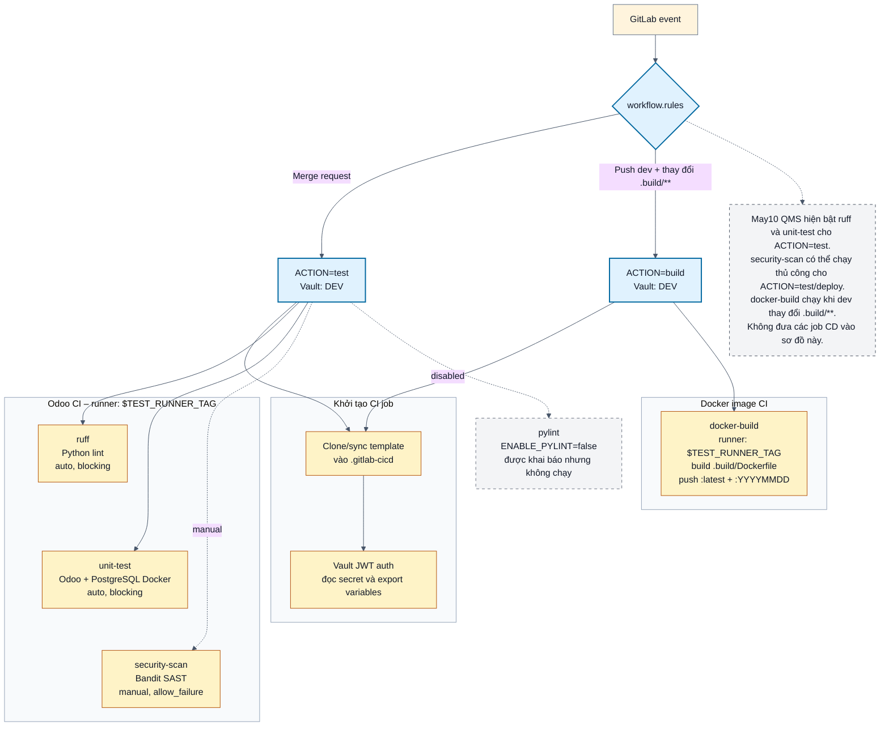

# May10 QMS – CI tổng quát

Phạm vi ở đây chỉ là CI: kiểm tra chất lượng code, chạy test, quét bảo mật và build Docker image. Phần CD như backup, deploy, update server image và rollback không nằm trong sơ đồ này.

Nguồn cấu hình:

- `pipelines/may10-qms.yml`
- `templates/odoo-cicd.yml`
- `templates/docker-cicd.yml`

## Các CI job tổng quát

| Job | Mục đích | Trạng thái trong May10 QMS |
|---|---|---|
| `ruff` | Lint Python | Bật, chạy tự động ở `ACTION=test` |
| `pylint` | Lint Python bổ sung | Tắt bởi `ENABLE_PYLINT=false` |
| `unit-test` | Chạy Odoo test trên PostgreSQL/Docker | Bật, chạy tự động ở `ACTION=test` |
| `security-scan` | Bandit SAST | Manual, `allow_failure` |
| `docker-build` | Build và push Docker image | Normal flow: push `dev` có thay đổi `.build/**` |

Các job `update-server-image`, `create-backup`, `deploy-server` và `rollback-on-upgrade-failure` là CD, nên đã loại khỏi sơ đồ này.
