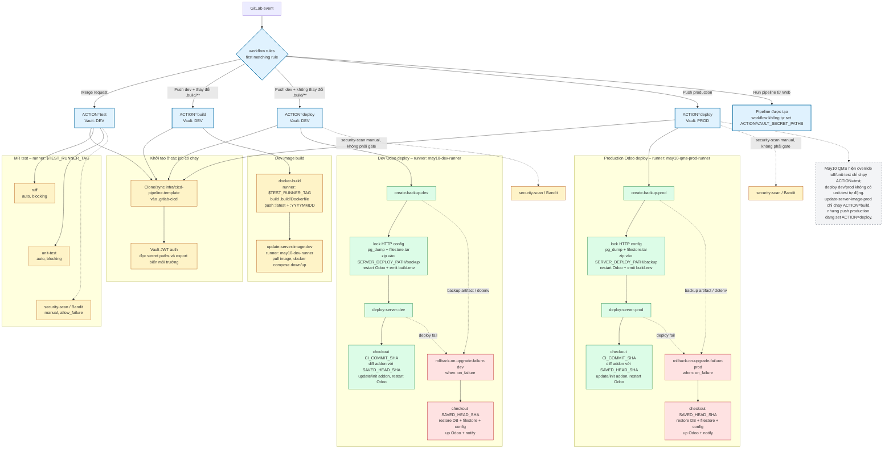

# May10 QMS – CI/CD thực tế

Sơ đồ dưới đây được dựng từ `pipelines/may10-qms.yml` và hai template mà pipeline này include:

- `templates/odoo-cicd.yml`
- `templates/docker-cicd.yml`

## Đọc nhanh

- Merge request: `ruff` và `unit-test` chạy trên Docker runner; Bandit là manual và cho phép fail.
- Push `dev` có thay đổi `.build/**`: build/push image rồi update server image trên dev.
- Push `dev` không thay đổi `.build/**`: backup dev → deploy dev; deploy lỗi thì rollback.
- Push `production`: backup prod → deploy prod; deploy lỗi thì rollback.
- `pylint` bị tắt (`ENABLE_PYLINT=false`).
- Backup hiện được tạo local ở `SERVER_DEPLOY_PATH/backup` và truyền đường dẫn qua dotenv; trong code pipeline hiện tại không có bước upload MinIO.

## Các điểm cần lưu ý khi đối chiếu README cũ

README tổng quát đang mô tả `integration-test`, MinIO và chuỗi `ruff → unit-test → integration-test`, nhưng cấu hình hiện tại của `may10-qms` không triển khai integration-test và override deploy thành `backup → deploy`. `unit-test` cũng có `needs: []`, nên khi nó được bật thì chạy độc lập, không chờ `ruff`.