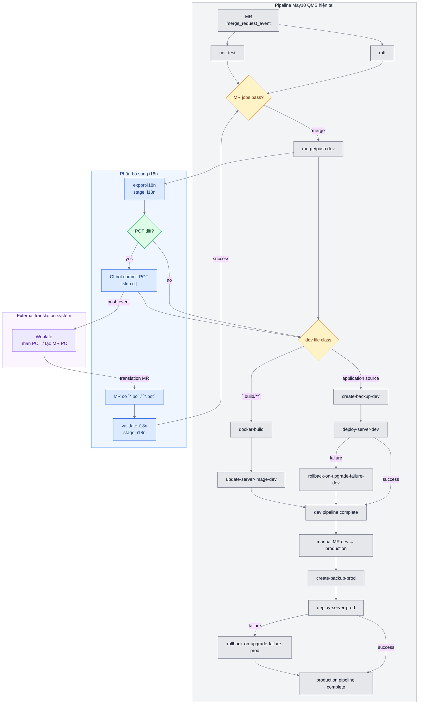

# Technical implementation plan: i18n CI cho May10 QMS

## 1. Scope và mục tiêu

### 1.1. Phạm vi

Tích hợp hai job i18n vào pipeline GitLab CI/CD của May10 QMS:

| Job | Trigger | Trách nhiệm |
|---|---|---|
| `validate-i18n` | MR có thay đổi `*.po` hoặc `*.pot` | Validate catalog và policy của MR; không có side effect lên repository/server |
| `export-i18n` | Push vào `dev` sau merge | Chạy Odoo export POT; commit các POT thay đổi vào `dev` bằng CI bot |

Không thay đổi logic của `ruff`, `unit-test`, `docker-build`, backup, deploy hoặc rollback.

### 1.2. Ngoài phạm vi

- Không mô tả cấu hình hoặc workflow nội bộ của hệ thống dịch.
- Không cho job i18n push vào `production`.
- Không để `export-i18n` sửa hoặc commit PO.
- Không thay thế pipeline deploy hiện tại.

### 1.3. Kết quả cần đạt

- MR source không thay đổi PO/POT: pipeline hiện tại giữ nguyên, `validate-i18n` được skip.
- MR có PO/POT: `validate-i18n` là blocking job.
- Merge vào `dev`: `export-i18n` hoàn thành trước deploy.
- POT không đổi: không tạo commit.
- POT đổi: bot commit đúng các file POT với `[skip ci]`.
- Export fail: không chạy backup/deploy dev.

## 2. Baseline May10 QMS

### 2.1. Nguồn cấu hình

- [`pipelines/may10-qms.yml`](../pipelines/may10-qms.yml)
- [`templates/odoo-cicd.yml`](../templates/odoo-cicd.yml)
- [`templates/docker-cicd.yml`](../templates/docker-cicd.yml)
- [`config/docker/Dockerfile.cicd-runner`](../config/docker/Dockerfile.cicd-runner)

### 2.2. Stage hiện tại

```yaml
stages:
  - build
  - quality
  - test
  - deploy
  - recovery
```

Stage mục tiêu phải thêm `i18n` giữa `test` và `deploy`:

```yaml
stages:
  - build
  - quality
  - test
  - i18n
  - deploy
  - recovery
```

### 2.3. Workflow và job hiện tại

| Event | `ACTION` | Job chính |
|---|---|---|
| MR | `test` | `ruff`, `unit-test`; `security-scan` manual/allow failure; `pylint` bị disable |
| Push `dev` có thay đổi `.build/**` | `build` | `docker-build` → `update-server-image-dev` |
| Push `dev` không thuộc nhánh build | `deploy` | `create-backup-dev` → `deploy-server-dev`; fail → `rollback-on-upgrade-failure-dev` |
| Push `production` | `deploy` | `create-backup-prod` → `deploy-server-prod`; fail → `rollback-on-upgrade-failure-prod` |

May10 QMS hiện có 17 job definition sau khi merge các template và override project. Tích hợp hai job i18n tạo tổng cộng 19 job definition; job được tạo hay skip phụ thuộc vào `workflow.rules` và `job.rules`.

### 2.4. Constraint khi tích hợp

- `validate-i18n` cần thêm GNU gettext/`msgfmt` vào runner hoặc image được chọn.
- `export-i18n` cần runner có Odoo, Python virtualenv, PostgreSQL và Manifestoo.
- Các dependency này là prerequisite của phần i18n, không thay đổi runner/deploy logic hiện tại.

## 3. Kiến trúc mục tiêu



## 4. CI integration contract

### 4.1. Template placement

Không copy inline job pilot vào `pipelines/may10-qms.yml`. Cấu trúc triển khai:

```text
templates/i18n-cicd.yml
├── validate-i18n
└── export-i18n

pipelines/may10-qms.yml
└── include templates/i18n-cicd.yml
```

Logic dài phải tách thành script được version-control và test độc lập:

```text
scripts/validate-i18n.sh       # diff, msgfmt, policy, placeholder
scripts/export-i18n.sh         # impact detection, Odoo export, commit/push
```

Pilot hiện tại nằm ở `/home/linh/odoo-qms/pipelines/i18n-test.yml`. Pilot có thể giữ dạng standalone với `stages: [i18n]`; khi include vào May10 phải merge `i18n` vào stage list hiện tại.

### 4.2. Runtime và concurrency của job mới

| Thuộc tính | `validate-i18n` | `export-i18n` |
|---|---|---|
| `stage` | `i18n` | `i18n` |
| Runtime | Runner/image hiện tại + GNU gettext | Shell runner hiện tại + Odoo/PostgreSQL/Manifestoo |
| `resource_group` | `may10-qms-i18n` | `may10-qms-i18n` |
| `allow_failure` | `false` | `false` |
| Push | Không | Chỉ `dev` |

`resource_group` bắt buộc để serialize workspace và thao tác push của `export-i18n`.

### 4.3. Stage dependency

Không cần `needs` trực tiếp tới `ruff`/`unit-test`; stage barrier đảm bảo `i18n` chỉ bắt đầu sau `test`. `deploy` chỉ được khởi tạo sau khi `i18n` pass hoặc job i18n được skip.

Đối với `export-i18n`, các commit chỉ đổi file irrelevant phải thoát trước bước tạo database. Đối với commit bot có `[skip ci]`, GitLab không tạo pipeline mới.

## 5. Job specification: `validate-i18n`

### 5.1. GitLab rule

```yaml
validate-i18n:
  stage: i18n
  resource_group: may10-qms-i18n
  allow_failure: false
  rules:
    - if: '$CI_PIPELINE_SOURCE == "merge_request_event"'
      changes:
        - '**/*.po'
        - '**/*.pot'
    - when: never
```

Behavior:

| MR content | Job state |
|---|---|
| Không có `*.po`/`*.pot` | Skip |
| Có `*.po`/`*.pot` | Run, blocking |
| File translation không tồn tại do bị delete | Không validate file đã delete; Git diff vẫn được ghi vào report |

### 5.2. Input

- `CI_MERGE_REQUEST_DIFF_BASE_SHA`
- `CI_COMMIT_SHA`
- Changed file list từ `git diff --name-only --diff-filter=ACMR`
- `CI_MERGE_REQUEST_SOURCE_PROJECT_PATH`
- `CI_MERGE_REQUEST_SOURCE_BRANCH_NAME`

`GIT_DEPTH` phải bằng `0` để bảo đảm diff base tồn tại.

### 5.3. Validation steps

1. Kiểm tra command availability: `git`, `msgfmt`, `python3`.
2. Xóa workspace riêng của job và kiểm tra Git worktree sạch.
3. Lấy danh sách PO/POT từ MR diff.
4. Chạy cho từng file:

   ```bash
   msgfmt --check --check-format --output-file=/dev/null path/to/file.po
   ```

5. Parse entry gettext bằng Python standard library:
   - so sánh placeholder `%s`, `%d`, `%(name)s`;
   - so sánh placeholder dạng `{name}` nếu project sử dụng;
   - kiểm tra `msgstr`/`msgstr[n]` tương thích với `msgid`/`msgid_plural`.
6. Nếu bật policy enforcement, kiểm tra source project/branch của MR.
7. Ghi log và artifact; trả về exit code khác `0` nếu có lỗi.

`msgfmt` chỉ kiểm tra format catalog. Nó không xác định được người sửa PO có được phép hay không; policy check là một bước độc lập.

### 5.4. Dependency

| Dependency | Bắt buộc | Sử dụng |
|---|---:|---|
| GNU gettext package | Có | Cung cấp `msgfmt` |
| `msgfmt` | Có | Parse và validate PO/POT |
| Git | Có | Tính MR diff |
| Python 3 | Có | Placeholder/policy checker |
| Bash + coreutils | Có | Job control, report, cleanup |
| Odoo | Không | Không export |
| PostgreSQL | Không | Không tạo database |

Implementation prerequisite: cài package `gettext` vào runtime được chọn cho job hoặc cấp một validation image riêng.

### 5.5. Policy configuration

Pilot sử dụng các biến:

```yaml
I18N_ENFORCE_PO_POLICY: "false"
I18N_ALLOWED_PO_SOURCE_PROJECT: ""
I18N_ALLOWED_PO_SOURCE_BRANCH_PREFIX: ""
```

Khi `I18N_ENFORCE_PO_POLICY=true`, MR PO/POT chỉ pass nếu thỏa một trong các điều kiện:

- `CI_MERGE_REQUEST_SOURCE_PROJECT_PATH` khớp `I18N_ALLOWED_PO_SOURCE_PROJECT`; hoặc
- `CI_MERGE_REQUEST_SOURCE_BRANCH_NAME` bắt đầu bằng `I18N_ALLOWED_PO_SOURCE_BRANCH_PREFIX`.

Trước khi bật enforcement trên May10 phải chốt source project/branch thực tế của nguồn translation. Không bật policy với giá trị rỗng vì sẽ làm fail toàn bộ MR PO/POT.

### 5.6. Output và failure semantics

Artifact:

```text
.ci-i18n-validate/changed-files.txt
.ci-i18n-validate/validation.log
.ci-i18n-validate/placeholder.log
.ci-i18n-validate/summary.txt
```

| Kết quả | Action |
|---|---|
| Pass | MR tiếp tục merge gate |
| `msgfmt` fail | Job fail, MR bị block |
| Placeholder fail | Job fail, MR bị block |
| Policy fail | Job fail, MR bị block |
| Job fail | Không push, không commit, không deploy |

## 6. Job specification: `export-i18n`

### 6.1. GitLab rule

```yaml
export-i18n:
  stage: i18n
  resource_group: may10-qms-i18n
  allow_failure: false
  rules:
    - if: '$CI_PIPELINE_SOURCE == "merge_request_event"'
      when: never
    - if: '$CI_PIPELINE_SOURCE == "push" && $CI_COMMIT_BRANCH == "dev"'
      when: on_success
    - when: never
```

Không chạy trên MR và không chạy trên `production`.

### 6.2. Input và required variables

```yaml
GIT_DEPTH: "0"
I18N_PUSH_ENABLED: "true"
I18N_PUSH_BRANCH: "dev"
I18N_PUSH_REMOTE: "origin"
I18N_GIT_USER_NAME: "Odoo i18n CI Bot"
I18N_GIT_USER_EMAIL: "odoo-i18n-bot@noreply.invalid"
I18N_COMMIT_MESSAGE: "[skip ci] [i18n] Update POT templates"
I18N_DB_PREFIX: "odoo_i18n"
```

Runtime variables:

```yaml
ODOO_SERIES: "18.0"
ODOO_CORE_ROOT: "..."
ODOO_BIN: ".../odoo-bin"
ODOO_PYTHON: ".../bin/python"
MANIFESTOO_BIN: ".../bin/manifestoo"
ODOO_DB_HOST: "127.0.0.1"
ODOO_DB_PORT: "5432"
ODOO_DB_USER: "odoo_ci"
ODOO_DB_PASSWORD: "..."
```

Path tuyệt đối của pilot chỉ dùng cho test; template dùng chung phải nhận các path bằng project/runner variables hoặc secret.

### 6.3. Execution flow

1. Checkout full history.
2. Xác định changed files từ `CI_COMMIT_BEFORE_SHA..CI_COMMIT_SHA`.
3. Phân loại file theo `I18N_GLOBAL_GLOBS` và `I18N_IRRELEVANT_GLOBS`.
4. Nếu không có source impact: ghi summary và exit `0` trước database creation.
5. Nếu có source impact hoặc unknown impact:
   - discover Odoo modules;
   - tính dependency bằng Manifestoo;
   - tạo database tạm;
   - cài dependency/module cần export;
   - gọi `odoo-bin --i18n-export` cho từng module.
6. Validate output bằng `msgfmt`.
7. Normalize timestamp/header nếu cần để diff ổn định.
8. Giới hạn generated list vào `*/i18n/*.pot`.
9. So sánh output với POT trong `HEAD`:
   - không đổi: exit `0`, không commit/push;
   - có đổi: commit bot và push `HEAD:refs/heads/dev`.
10. Cleanup database/workspace và upload artifact.

Odoo thực hiện message extraction. GNU gettext/`msgfmt` chỉ thực hiện parse/format validation và không thay thế `odoo-bin --i18n-export`.

### 6.4. Dependency

| Dependency | Bắt buộc | Sử dụng |
|---|---:|---|
| Odoo runtime đúng version | Có | Export POT |
| Python 3 + QMS virtualenv | Có | Chạy Odoo và dependency |
| Manifestoo | Có | Module/dependency graph |
| GNU gettext | Có | Cung cấp `msgfmt` để validate POT |
| `msgfmt` | Có | Validate output |
| PostgreSQL server | Có | Database tạm |
| `psql`, `pg_isready`, `createdb`, `dropdb` | Có | DB lifecycle |
| Git | Có | Diff, stage, commit, push |
| `find`, `realpath`, `comm` | Có | Discovery và compare |
| GitLab CI job token | Có khi push bật | Push vào `dev` |

### 6.5. Impact detection contract

`I18N_IRRELEVANT_GLOBS` tối thiểu phải chứa:

```text
**/*.po
**/*.pot
.build/**
docs/**
.ci/**
requirements/**
Dockerfile*
docker-compose*.yml
```

Behavior:

| Diff | Action |
|---|---|
| Chỉ có PO/POT hoặc file irrelevant | Không tạo DB, không gọi Odoo, exit `0` |
| Có source module change | Export module bị ảnh hưởng |
| Có global/unknown change | Full/conservative export theo `I18N_IMPACT_POLICY` |
| Có cả irrelevant và source change | Export theo source change |

Không được dùng `rules:changes` làm cơ chế duy nhất cho mixed commit; detector phải đọc toàn bộ diff.

### 6.6. Output, commit và failure semantics

Allowed generated output:

```text
<module>/i18n/<module>.pot
```

Commit policy:

- chỉ commit generated POT;
- target branch là `dev`;
- commit message có `[skip ci]`;
- không force-push;
- token chỉ có quyền cần thiết trên repository/branch;
- kiểm tra branch/head trước push;
- dùng `resource_group` để serialize export/push.

| Kết quả | Action |
|---|---|
| Không có relevant source change | Pass, không DB/export/commit/push |
| POT không đổi | Pass, không commit/push |
| POT đổi | Commit/push bot, pipeline hiện tại tiếp tục |
| Export/validation fail | Job fail, deploy stage không chạy |
| DB/cleanup fail | Ghi log, job fail theo cleanup policy; không push output không hợp lệ |

## 7. Files và thay đổi dự kiến

### 7.1. Pilot hiện tại

File test:

- `/home/linh/odoo-qms/pipelines/i18n-test.yml`

Pilot phải có hai job `validate-i18n` và `export-i18n`, cùng `resource_group`, với `stages: [i18n]`.

### 7.2. Template dùng chung

Files cần tạo hoặc cập nhật khi triển khai May10:

```text
templates/i18n-cicd.yml
scripts/validate-i18n.sh
scripts/export-i18n.sh
config/docker/Dockerfile.cicd-runner   # thêm gettext nếu dùng Docker runner
pipelines/may10-qms.yml                # include + thêm stage i18n + variables
```

Không đưa Odoo runtime hoặc PostgreSQL server vào image validation nếu `validate-i18n` chỉ cần `msgfmt`.

## 8. Test matrix

| Case | Trigger | Expected jobs | Expected result |
|---|---|---|---|
| Source-only MR | MR, không có PO/POT | `ruff`, `unit-test`; `validate-i18n` skip | Merge gate hiện tại không đổi |
| PO/POT hợp lệ | MR có PO/POT | `ruff`, `unit-test`, `validate-i18n` | Pass |
| PO syntax lỗi | MR có PO/POT | `validate-i18n` | Fail, block merge |
| Placeholder mismatch | MR có PO/POT | `validate-i18n` | Fail, block merge |
| PO từ branch không được phép | MR có PO/POT, policy bật | `validate-i18n` | Fail, block merge |
| Push source vào `dev`, POT không đổi | Push `dev` | `export-i18n` | Không DB/export commit; deploy tiếp tục |
| Push source vào `dev`, POT đổi | Push `dev` | `export-i18n` | Bot commit POT `[skip ci]`; deploy tiếp tục |
| Push chỉ PO/POT vào `dev` | Push `dev` | `export-i18n` | Impact detector skip DB/export |
| Export fail | Push source vào `dev` | `export-i18n` | Không chạy backup/deploy dev |
| Push `production` | Push `production` | Không có job i18n | Production flow hiện tại giữ nguyên |

## 9. Acceptance criteria

1. GitLab configuration tạo đúng hai job và `stages` đặt `i18n` giữa `test` và `deploy`.
2. `validate-i18n` là blocking job, chỉ được tạo cho MR có PO/POT và có đầy đủ artifact/log lỗi.
3. `export-i18n` chỉ chạy trên push `dev`, có impact detection và không tạo database cho irrelevant-only diff.
4. Runtime của từng job pass preflight dependency: GNU gettext cho validation; Odoo, PostgreSQL, Manifestoo và GNU gettext cho export.
5. Side effect của export bị giới hạn trong generated POT và commit bot vào `dev`; không force-push, commit có `[skip ci]`.
6. Export/validation fail không cho phép deploy tiếp và không để lại workspace residue ảnh hưởng pipeline kế tiếp.
7. Toàn bộ test case trong mục 8 pass trên pilot trước khi include vào May10 QMS.